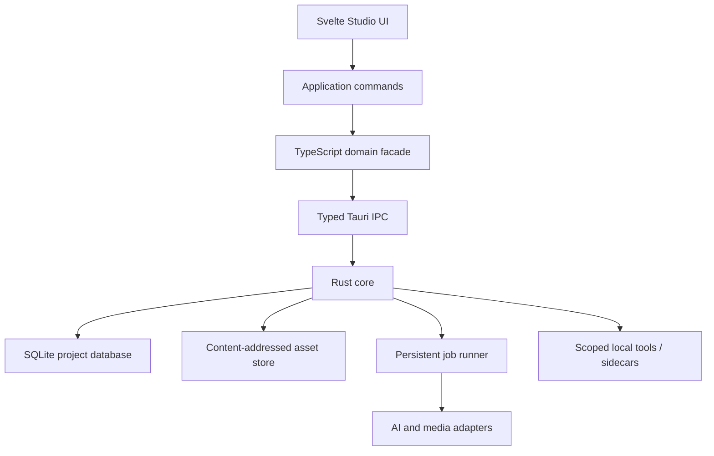
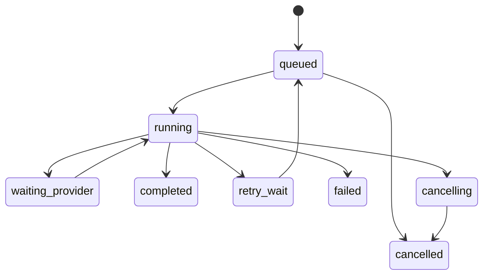

# Doodle — Implementation Plan and Agent-Executable Technical Specification

> Status: implementation-ready draft  
> Research snapshot: 2026-09-21  
> Product: **Doodle** (`/studio`, later `/lab`)  
> Baseline: **Svelte 5 + TypeScript + Tauri 2 + Rust + SQLite**  
> Audience: Tinodaishe Tembo and coding agents operating in Codex or Claude Code  
> Existing constraint: the visual design system already exists and must be consumed, not replaced.

---

## 0. How to use this document

This file is both a product implementation plan and an execution contract for coding agents.

### Human usage

1. Read sections 1–6 once to understand the product and architecture.
2. Approve or amend the decisions in **Decision Log** before implementation.
3. Start at `S0`, never at the visually exciting features.
4. Complete one task packet at a time and enforce its exit gate.
5. Revisit the success matrix after every milestone.

### Agent usage

An implementation agent MUST:

- [ ] Read `AGENTS.md` if present, this file, the existing design-system docs, and relevant local code before editing.
- [ ] Work only on the first incomplete task whose dependencies are complete, unless explicitly assigned another task ID.
- [ ] Convert the chosen task into a short plan before editing.
- [ ] Preserve existing user changes and avoid unrelated refactors.
- [ ] Add or update tests in the same change as behavior.
- [ ] Run the task's validation commands and report exact results.
- [ ] Mark a checkbox complete only after its acceptance criteria pass.
- [ ] Record material architectural choices in `docs/adr/`.
- [ ] Stop at the task packet's exit gate; do not silently start the next epic.
- [ ] If blocked, write a concise blocker note under the task and leave the checkbox incomplete.

Recommended invocation:

```text
Read AGENTS.md if present and Doodle_Implementation_Plan.md completely.
Implement task <TASK-ID> only. Respect its dependencies, invariants, non-goals,
acceptance criteria, performance budget, and validation commands. Inspect the
existing design system before creating UI. Update tests and the task checkbox.
Stop after the task's exit gate and report changed files, validation results,
risks, and the next unblocked task.
```

### Checkbox semantics

- `[ ]` — not started or not proven
- `[~]` — in progress; do not use in committed mainline docs
- `[x]` — acceptance criteria and validation passed
- `[!]` — blocked; include a reason and owner immediately below

### Definition of “done” for every task

A task is done only when:

1. behavior exists and matches the acceptance criteria;
2. automated tests cover the important success and failure paths;
3. keyboard and accessibility behavior has been checked where UI is involved;
4. telemetry contains no prompt, document, or asset content by default;
5. migrations and persisted formats are backward-safe;
6. relevant docs are updated;
7. lint, typecheck, unit tests, Rust tests, and the relevant end-to-end slice pass;
8. no TODO was hidden in production code without a linked task ID.

---

## 1. Product thesis

Doodle is a **recursively zoomable creative document**, not a chat wrapper and not a prettier ComfyUI.

The defining rule is:

> Every meaningful creative object can be a node; every sufficiently complex node can be entered as a workspace; zoom changes abstraction, not merely size.

A film is a node containing acts and scenes. A scene is a node containing beats and shots. A manga is a node containing chapters and pages. A page is both a node on the project canvas and a full composition surface when entered. A generated image is an asset, an editable object, and a lineage node.

The product should make the user feel that they are **directing a coherent world**, not repeatedly prompt-engineering disconnected generations.

### 1.1 Product namespaces

| Namespace | Purpose | Timing |
| --- | --- | --- |
| `Doodle / Studio` | Content-centric creation: write, arrange, storyboard, generate, review, canonize | MVP |
| `Doodle / Library` | Characters, locations, styles, references, props, reusable assets | MVP-lite, expands after MVP |
| `Doodle / Render` | Persistent generation jobs, status, retries, outputs, cost and provenance | MVP |
| `Doodle / Lab` | Process-centric workflow graph and low-level provider/model plumbing | Post-MVP |

### 1.2 Ten immutable UX principles

1. **The work dominates the chrome.**
2. **Scale is a mode switch.** Far = structure; medium = composition; close = editing; very close = detail.
3. **Creative semantics are visible; computational plumbing is hidden in Studio.**
4. **AI proposes; the user canonizes.** Generated suggestions are ghost/draft objects until accepted.
5. **References are reusable world objects, not disposable prompt attachments.**
6. **Generation lineage is queryable and spatially revealable.**
7. **Context comes from selection, location, ancestry, and project rules—not giant chat history.**
8. **The user can always undo, inspect source context, and recover prior versions.**
9. **No AI action silently overwrites canon.**
10. **Directing language wins over model language.** “Slow push-in, 50 mm” is primary; “guidance 6” is advanced metadata.

### 1.3 What Doodle is not

- Not a general-purpose vector editor in MVP.
- Not a full NLE, DAW, 3D package, or Photoshop replacement.
- Not a collaborative SaaS in MVP.
- Not dependent on subscription-token extraction or undocumented model endpoints.
- Not a canvas that renders every nested object at full fidelity at once.
- Not a graph where every relationship is permanently drawn as a wire.
- Not a system that trains on or uploads the whole project without explicit scope.

---

## 2. Research synthesis and competitive translation

The implementation borrows interaction lessons, not product structure.

| Product/pattern | Useful lesson | Doodle translation | Explicit rejection |
| --- | --- | --- | --- |
| Runway Tools / Apps / Agent / Workflows | Different levels of precision should coexist; sessions keep generations organized | One command surface with progressive disclosure; persisted render jobs and creative branches | Four disconnected destinations for the same project |
| Runway Story Panels | Narrative expansion benefits from an input anchor and staged outputs | Scene → ghost shot list → approved storyboard frames | Immediately generating pretty panels before editorial approval |
| Higgsfield Canvas | Prompts, references, models, and outputs can be chained spatially | Spatial asset lineage in Studio; actual pipeline graph later in Lab | Showing model plumbing in ordinary creative work |
| Midjourney Web | A prominent creation bar, fast candidates, vary/edit loop, reusable references | Persistent contextual command bar; candidates bloom beside source; style/character objects | A generation feed disconnected from project structure |
| Kling/cinematic generators | Camera, motion, start/end frames, and subject references map to creative intent | Typed shot/camera controls translated by provider adapters | Exposing provider-specific parameter names as the main UI |
| Figma | Selection-driven inspector, direct manipulation, restrained chrome | Right inspector, command palette, object-first manipulation | Treating every creative action as a modal wizard |
| Milanote/studio wall | Spatial clustering helps ideation | Freeform boards within semantic containers | Losing canonical order and hierarchy in pure freeform space |
| NLEs | Time, shots, takes, bins, and non-destructive edits are proven concepts | Shot order, duration, takes, preferred output, render queue | Full multitrack editing before the core authoring loop works |

Research-backed constraints:

- Runway explicitly separates precise tools, purpose-built apps, an agent, and node workflows. Doodle should unify these levels through context and progressive disclosure rather than duplicate their navigation ([Runway guide](https://help.runwayml.com/hc/en-us/articles/37425232841875-Getting-Started-with-Generative-Video)).
- Runway Story Panels uses an image plus a focused narrative instruction to extend a visual world. Doodle should add the missing editorial approval stage before generation ([Story Panels](https://help.runwayml.com/hc/en-us/articles/50985233945747-Story-Panels)).
- Higgsfield defines its canvas as connected prompts, references, models, and outputs. Doodle's Studio graph instead represents creative meaning; its future Lab may expose generation flow ([Higgsfield Canvas](https://higgsfield.ai/canvas-intro)).
- Midjourney's web creation flow keeps creation, settings, references, and iteration close together. Doodle adopts the compact contextual command surface, but attaches outputs to semantic project objects ([Midjourney Web](https://docs.midjourney.com/hc/en-us/articles/33390732264589-Creating-on-Web)).

---

## 3. MVP definition

### 3.1 MVP user promise

> “I can create a film, graphic narrative, or prose project; structure it spatially; enter any scene/page; write and arrange content; attach reusable characters/styles/references; ask AI for scoped suggestions; approve those suggestions; generate storyboard images; and always understand where every result came from.”

### 3.2 Chosen MVP vertical slice

The reference project is a **short film / visual narrative**, because it exercises hierarchy, writing, shots, references, image generation, and lineage without requiring a mature drawing engine or full video timeline.

MVP supports three project templates through the same domain model:

1. `Film / animation`: Project → Act/Sequence → Scene → Beat → Shot → Take/Asset
2. `Manga / graphic narrative`: Project → Volume → Chapter → Page → Panel → Asset
3. `Prose`: Project → Part → Chapter → Scene → Beat

Only the film template must complete the full generate-and-canonize acceptance path before MVP release. Manga and prose must support structure and writing; advanced page drawing and publishing remain later.

### 3.3 MVP must-have scope

- Project creation, open, close, duplicate, archive, import, and export.
- Infinite canvas with pan/zoom, selection, lasso, keyboard movement, focus/enter, escape/up-level, minimap, and breadcrumbs.
- Semantic zoom with at least three visual levels.
- Typed nodes and typed semantic relationships.
- Ordered containment plus freeform canvas placement.
- Scene/screenplay writer using a schema-based rich text document.
- Project bible and inherited style/character/location references.
- Contextual inspector and command bar.
- Undo/redo for all local structural and text operations.
- Auto-save, crash recovery, schema migrations, and project backups.
- AI text provider through a stable provider interface; mock provider always available.
- AI suggestions as ghost nodes or patch previews; explicit accept/reject.
- One image-generation adapter and a mock image adapter.
- Persistent render/job queue with cancel/retry and restart recovery.
- Asset ingestion, hashing, thumbnails, metadata, provenance, and lineage.
- Canon/Draft/Exploration/Rejected state.
- Search across titles, text, tags, and object types.
- Portable project export with a validated manifest.

### 3.4 Deferred from MVP

- Full video generation UI; architecture and mock job only in MVP, first real adapter in Beta.
- Doodle Lab workflow authoring.
- Real-time collaboration and CRDTs.
- Cloud sync, accounts, payments, teams, public sharing.
- Full manga lettering/drawing/brush engine.
- Full NLE, audio mixing, compositing, keyframes, or color grading.
- Blender automation beyond a future tool contract.
- Plugin marketplace.
- Mobile application.
- Automatic multi-agent orchestration.
- Provider-specific advanced panels beyond a debug drawer.

### 3.5 MVP end-to-end acceptance scenario

The MVP is not complete until a clean install can demonstrate this sequence without developer tooling:

1. Create a project from `Short Film`.
2. Add three scenes on the project canvas and reorder them.
3. Enter Scene 2 with double-click or `Enter`; breadcrumb changes without a hard navigation discontinuity.
4. Write a scene and convert highlighted text into two beats.
5. Add a character and a style object; attach them to Scene 2.
6. Select Scene 2 and ask: “Propose six visual shots, quiet and tense.”
7. See six ghost shot nodes; accept four, reject two.
8. Reorder accepted shots; edit camera metadata on one shot.
9. Generate four mock or real storyboard candidates for a shot.
10. Promote one candidate to preferred take and mark it Canon.
11. Zoom out and see project progress/state without full-fidelity nested rendering.
12. Quit during an in-flight mock job, relaunch, and see the job reconciled.
13. Undo and redo a structural change after relaunch where supported by the persisted command boundary.
14. Export the project, import it into a clean profile, and retain hierarchy, text, references, assets, and provenance.

---

## 4. Architecture decisions

### 4.1 High-level architecture



Boundary rule: the Svelte webview never receives unrestricted filesystem, shell, or secret access. It issues typed application commands to Rust. Rust validates scope, owns persistence, executes jobs, and emits typed events.

### 4.2 Technology selection

| Layer | Decision | Why | Revisit trigger |
| --- | --- | --- | --- |
| Desktop shell | Tauri 2 | Small native shell, Rust core, granular capabilities, sidecars, updater | Required platform API unavailable or webview parity becomes untenable |
| UI | Svelte 5 + TypeScript + Vite | Existing base, compact reactivity, custom node rendering | None before v1 |
| Package manager | pnpm, exact lockfile | Deterministic workspace and efficient installs | Existing repository uses another manager |
| Canvas MVP | `@xyflow/svelte` behind `CanvasAdapter` | Custom Svelte nodes, viewport, selection, grouping, visible-only rendering, keyboard baseline | Performance spike fails budgets or recursive focus cannot be made coherent |
| Text editor | Tiptap Core / ProseMirror schema with custom Svelte wrapper | Structured screenplay/prose nodes, deterministic JSON, transaction model | IME/accessibility spike fails |
| Native core | Rust modules inside Tauri crate, split by domain | Persistence/security/jobs belong outside webview | Core becomes large enough for workspace crates |
| Database | SQLite in Rust via `sqlx` or `rusqlite` (choose in S0 ADR) | Local-first, transactional, portable, FTS5, JSON fields | Multi-user cloud service—not MVP |
| Search | SQLite FTS5 + typed filters | No extra process; enough for project-scale text/object search | Cross-project semantic search needs vector index |
| Binary assets | Content-addressed files under project package | Avoid DB bloat, dedupe, stable lineage | Remote/cloud asset store |
| Secrets | OS credential store via Rust `keyring`; optional Stronghold fallback | Keeps secrets out of JS and project files | Platform support test fails |
| Background work | Rust Tokio tasks + SQLite-persisted job state | Restart-safe generations/transcodes | Distributed/cloud workers |
| Image/media metadata | Rust crates plus `ffprobe` adapter when needed | Fast local inspection | Unsupported formats require external tooling |
| Transcoding | User-installed FFmpeg in alpha; signed bundled sidecar only after license/distribution review | Reduces early packaging risk | Beta distribution readiness |
| Unit tests | Vitest + Testing Library; `cargo test` | Fast layer tests | None |
| Desktop E2E | WebdriverIO Tauri service; browser-mode subset for speed | Current Tauri-recommended path, macOS-capable embedded driver | Flaky driver or CI platform limitation |
| CI | GitHub Actions or existing CI, matrix by OS at release gates | Cross-platform packaging needs native runners | Repository host differs |

Svelte Flow currently exposes custom nodes, subflows/grouping examples, viewport controls, keyboard interaction, and an `onlyRenderVisibleElements` optimization. Treat it as an MVP implementation detail, not the domain model ([Svelte Flow](https://svelteflow.dev/), [component API](https://svelteflow.dev/api-reference/svelte-flow)).

Tiptap has an official Svelte 5 integration path and is based on ProseMirror's schema/transaction model; Doodle stores editor JSON under its own versioned schema rather than treating rendered HTML as canonical ([Tiptap Svelte](https://tiptap.dev/docs/editor/getting-started/install/svelte), [ProseMirror guide](https://prosemirror.net/docs/guide/)).

### 4.3 Architectural invariants

- Every persisted ID is a UUIDv7 or equivalent time-sortable opaque ID generated in Rust.
- Every project mutation is transactional.
- UI components never construct SQL.
- Provider SDK types never leak past adapter boundaries.
- A provider result is never a canonical project object until an explicit promote/accept command succeeds.
- Assets are immutable blobs; edits create new assets and lineage edges.
- Object content and canvas presentation are separate records.
- Containment order is semantic; x/y position is presentational.
- Provider credentials never enter logs, SQLite, exported projects, crash reports, or Svelte stores.
- Database and manifest versions move only forward through explicit migrations.
- Deleting an object is soft-delete first; irreversible purge is a separate maintenance action.
- Any long-running action is a persistent job with a stable idempotency key.

### 4.4 Why not event sourcing everywhere

Full event sourcing adds projection, migration, and debugging complexity that does not improve the MVP. Use:

- normalized current-state tables;
- a command journal for undo/audit-relevant user operations;
- immutable asset provenance;
- periodic snapshots for recovery.

This provides non-destructive creativity without making every read a replay.

### 4.5 Why not CRDTs yet

Doodle is initially a personal desktop tool. CRDTs complicate ordered trees, ProseMirror schemas, migrations, and asset reconciliation. Preserve future compatibility by using stable IDs, operation timestamps, actor IDs (`local:<installation-id>`), and explicit revisions. Add Automerge/Yjs only when real collaboration is funded and specified.

---

## 5. Repository and module structure

Adapt to the existing repository; do not churn paths solely to match this sketch.

```text
doodle/
├── AGENTS.md
├── Doodle_Implementation_Plan.md
├── package.json
├── pnpm-lock.yaml
├── vite.config.ts
├── src/
│   ├── app/
│   │   ├── App.svelte
│   │   ├── routes/
│   │   ├── commands/
│   │   └── events/
│   ├── design-system/          # existing system; import, do not fork casually
│   ├── domain/
│   │   ├── ids.ts
│   │   ├── objects.ts
│   │   ├── relationships.ts
│   │   ├── projects.ts
│   │   ├── assets.ts
│   │   ├── jobs.ts
│   │   └── schemas.ts
│   ├── canvas/
│   │   ├── adapter.ts
│   │   ├── CanvasSurface.svelte
│   │   ├── semantic-zoom.ts
│   │   ├── selection.ts
│   │   ├── camera.ts
│   │   ├── layout/
│   │   └── nodes/
│   ├── editors/
│   │   ├── screenplay/
│   │   ├── prose/
│   │   └── page/
│   ├── features/
│   │   ├── project-bible/
│   │   ├── object-library/
│   │   ├── command-bar/
│   │   ├── inspector/
│   │   ├── generation/
│   │   ├── search/
│   │   └── export/
│   ├── platform/
│   │   ├── ipc.ts
│   │   ├── events.ts
│   │   ├── shortcuts.ts
│   │   └── paths.ts
│   └── test/
├── src-tauri/
│   ├── Cargo.toml
│   ├── capabilities/
│   ├── migrations/
│   └── src/
│       ├── lib.rs
│       ├── commands/
│       ├── domain/
│       ├── persistence/
│       ├── assets/
│       ├── jobs/
│       ├── providers/
│       │   ├── mod.rs
│       │   ├── mock.rs
│       │   ├── openai_api.rs
│       │   ├── codex_app_server.rs
│       │   ├── anthropic_api.rs
│       │   └── video/
│       ├── secrets/
│       ├── search/
│       ├── export/
│       └── telemetry/
├── tests/
│   ├── fixtures/
│   ├── e2e/
│   ├── visual/
│   └── perf/
└── docs/
    ├── adr/
    ├── schemas/
    ├── threat-model.md
    ├── test-matrix.md
    └── release-checklist.md
```

### 5.1 Dependency direction

```text
UI components
  -> feature services
    -> domain interfaces
      -> typed IPC client

Tauri commands
  -> Rust application services
    -> repositories / jobs / provider ports
      -> SQLite / filesystem / HTTP / sidecar adapters
```

Never import provider adapters from UI code. Never import Svelte Flow node types into domain objects. Never make persistence records the public IPC contract.

---

## 6. Domain model

### 6.1 Universal creative object

All creative items share a small envelope. Type-specific payloads are validated separately.

```ts
export type ObjectId = string;
export type ProjectId = string;

export type CreativeObjectKind =
  | 'project'
  | 'container'
  | 'act'
  | 'sequence'
  | 'scene'
  | 'beat'
  | 'shot'
  | 'take'
  | 'volume'
  | 'chapter'
  | 'page'
  | 'panel'
  | 'document'
  | 'character'
  | 'location'
  | 'style'
  | 'prop'
  | 'costume'
  | 'reference'
  | 'image'
  | 'video'
  | 'audio'
  | 'note';

export type CanonState = 'canon' | 'draft' | 'exploration' | 'rejected';

export interface CreativeObject<TPayload = unknown> {
  id: ObjectId;
  projectId: ProjectId;
  kind: CreativeObjectKind;
  title: string;
  status: CanonState;
  schemaVersion: number;
  payload: TPayload;
  createdAt: string;
  updatedAt: string;
  deletedAt: string | null;
  revision: number;
}
```

Rules:

- `payload` is JSON but is never unvalidated arbitrary JSON at a boundary.
- `revision` increments on mutation and supports optimistic UI/conflict detection.
- `deletedAt` removes an object from ordinary queries while keeping recovery possible.
- status changes are commands with recorded authorship and timestamp.

### 6.2 Relationship types

```ts
export type RelationshipKind =
  | 'contains'
  | 'ordered-before'
  | 'references'
  | 'appears-in'
  | 'located-at'
  | 'styled-by'
  | 'uses-prop'
  | 'generated-from'
  | 'variation-of'
  | 'replaces'
  | 'preferred-take-of'
  | 'derived-from-document'
  | 'related-to';
```

Relationship categories:

| Category | Stored as | Visible by default | Example |
| --- | --- | --- | --- |
| Containment | parent link + ordered position | Via nesting, not wire | Scene contains shots |
| Editorial order | fractional/index order key | Layout/order | Shot 3 follows Shot 2 |
| Semantic reference | relationship table | On selection / Doodle Lens | Shot styled by Nocturne |
| Generation lineage | relationship + generation record | Soft connector / history | Candidate generated from Shot |
| Replacement/version | relationship | History | Image v3 replaces v2 |

Do not encode containment solely as graph edges. Parent/child queries and ordered traversal are hot paths and deserve indexed columns.

### 6.3 Canvas presentation record

```ts
export interface CanvasPlacement {
  objectId: ObjectId;
  canvasId: ObjectId;
  x: number;
  y: number;
  width: number;
  height: number;
  rotation: number;
  zIndex: number;
  collapsed: boolean;
  presentation: Record<string, unknown>;
}
```

One object may appear on more than one canvas through distinct placements. Deleting a placement does not delete the object. “Move to another scene” is a semantic containment command, not a coordinate edit.

### 6.4 Suggested SQLite schema

The final DDL belongs in numbered Rust migrations. This sketch defines intent.

```sql
CREATE TABLE projects (
  id TEXT PRIMARY KEY,
  title TEXT NOT NULL,
  template_kind TEXT NOT NULL,
  schema_version INTEGER NOT NULL,
  root_object_id TEXT NOT NULL,
  settings_json TEXT NOT NULL DEFAULT '{}',
  created_at TEXT NOT NULL,
  updated_at TEXT NOT NULL,
  archived_at TEXT
);

CREATE TABLE objects (
  id TEXT PRIMARY KEY,
  project_id TEXT NOT NULL REFERENCES projects(id) ON DELETE CASCADE,
  kind TEXT NOT NULL,
  title TEXT NOT NULL,
  canon_state TEXT NOT NULL CHECK (canon_state IN ('canon','draft','exploration','rejected')),
  schema_version INTEGER NOT NULL,
  payload_json TEXT NOT NULL,
  parent_id TEXT REFERENCES objects(id),
  order_key TEXT,
  revision INTEGER NOT NULL DEFAULT 1,
  created_at TEXT NOT NULL,
  updated_at TEXT NOT NULL,
  deleted_at TEXT
);

CREATE INDEX idx_objects_project_kind ON objects(project_id, kind) WHERE deleted_at IS NULL;
CREATE INDEX idx_objects_parent_order ON objects(parent_id, order_key) WHERE deleted_at IS NULL;

CREATE TABLE relationships (
  id TEXT PRIMARY KEY,
  project_id TEXT NOT NULL REFERENCES projects(id) ON DELETE CASCADE,
  source_id TEXT NOT NULL REFERENCES objects(id),
  target_id TEXT NOT NULL REFERENCES objects(id),
  kind TEXT NOT NULL,
  metadata_json TEXT NOT NULL DEFAULT '{}',
  created_at TEXT NOT NULL,
  deleted_at TEXT,
  UNIQUE(source_id, target_id, kind)
);

CREATE TABLE canvases (
  id TEXT PRIMARY KEY,
  project_id TEXT NOT NULL REFERENCES projects(id) ON DELETE CASCADE,
  owner_object_id TEXT NOT NULL REFERENCES objects(id),
  viewport_json TEXT NOT NULL,
  layout_mode TEXT NOT NULL DEFAULT 'freeform',
  updated_at TEXT NOT NULL
);

CREATE TABLE placements (
  canvas_id TEXT NOT NULL REFERENCES canvases(id) ON DELETE CASCADE,
  object_id TEXT NOT NULL REFERENCES objects(id),
  x REAL NOT NULL,
  y REAL NOT NULL,
  width REAL NOT NULL,
  height REAL NOT NULL,
  rotation REAL NOT NULL DEFAULT 0,
  z_index INTEGER NOT NULL DEFAULT 0,
  collapsed INTEGER NOT NULL DEFAULT 0,
  presentation_json TEXT NOT NULL DEFAULT '{}',
  PRIMARY KEY (canvas_id, object_id)
);

CREATE TABLE documents (
  object_id TEXT PRIMARY KEY REFERENCES objects(id) ON DELETE CASCADE,
  doc_kind TEXT NOT NULL,
  schema_version INTEGER NOT NULL,
  content_json TEXT NOT NULL,
  plain_text TEXT NOT NULL,
  word_count INTEGER NOT NULL DEFAULT 0,
  revision INTEGER NOT NULL DEFAULT 1,
  updated_at TEXT NOT NULL
);

CREATE TABLE assets (
  id TEXT PRIMARY KEY,
  project_id TEXT NOT NULL REFERENCES projects(id) ON DELETE CASCADE,
  sha256 TEXT NOT NULL,
  media_kind TEXT NOT NULL,
  mime_type TEXT NOT NULL,
  byte_length INTEGER NOT NULL,
  relative_path TEXT NOT NULL,
  original_name TEXT,
  width INTEGER,
  height INTEGER,
  duration_ms INTEGER,
  metadata_json TEXT NOT NULL DEFAULT '{}',
  created_at TEXT NOT NULL,
  UNIQUE(project_id, sha256)
);

CREATE TABLE object_assets (
  object_id TEXT NOT NULL REFERENCES objects(id) ON DELETE CASCADE,
  asset_id TEXT NOT NULL REFERENCES assets(id),
  role TEXT NOT NULL,
  ordinal INTEGER NOT NULL DEFAULT 0,
  PRIMARY KEY (object_id, asset_id, role)
);

CREATE TABLE generations (
  id TEXT PRIMARY KEY,
  project_id TEXT NOT NULL REFERENCES projects(id) ON DELETE CASCADE,
  source_object_id TEXT REFERENCES objects(id),
  provider_id TEXT NOT NULL,
  capability TEXT NOT NULL,
  model_id TEXT,
  request_json TEXT NOT NULL,
  normalized_prompt TEXT,
  provider_prompt TEXT,
  seed TEXT,
  cost_json TEXT,
  started_at TEXT,
  completed_at TEXT,
  error_json TEXT
);

CREATE TABLE generation_outputs (
  generation_id TEXT NOT NULL REFERENCES generations(id) ON DELETE CASCADE,
  asset_id TEXT NOT NULL REFERENCES assets(id),
  ordinal INTEGER NOT NULL,
  PRIMARY KEY (generation_id, ordinal)
);

CREATE TABLE jobs (
  id TEXT PRIMARY KEY,
  project_id TEXT REFERENCES projects(id) ON DELETE CASCADE,
  kind TEXT NOT NULL,
  state TEXT NOT NULL,
  priority INTEGER NOT NULL DEFAULT 0,
  idempotency_key TEXT NOT NULL UNIQUE,
  request_json TEXT NOT NULL,
  progress_json TEXT NOT NULL DEFAULT '{}',
  result_json TEXT,
  error_json TEXT,
  attempt INTEGER NOT NULL DEFAULT 0,
  max_attempts INTEGER NOT NULL DEFAULT 3,
  available_at TEXT NOT NULL,
  created_at TEXT NOT NULL,
  updated_at TEXT NOT NULL
);

CREATE TABLE command_journal (
  seq INTEGER PRIMARY KEY AUTOINCREMENT,
  project_id TEXT NOT NULL REFERENCES projects(id) ON DELETE CASCADE,
  command_id TEXT NOT NULL UNIQUE,
  command_kind TEXT NOT NULL,
  forward_json TEXT NOT NULL,
  inverse_json TEXT,
  group_id TEXT,
  actor_id TEXT NOT NULL,
  created_at TEXT NOT NULL
);

CREATE VIRTUAL TABLE object_search USING fts5(
  object_id UNINDEXED,
  project_id UNINDEXED,
  title,
  body,
  tags,
  tokenize = 'unicode61'
);
```

SQLite FTS5 is purpose-built for full-text search, while WAL mode allows readers and a writer to operate concurrently with important same-machine constraints. Enable WAL per project, set a bounded busy timeout, checkpoint deliberately, and never put a live project DB on a network filesystem ([FTS5](https://www.sqlite.org/fts5.html), [WAL](https://www.sqlite.org/wal.html), [JSON functions](https://www.sqlite.org/json1.html)).

### 6.5 Project package layout

Use a visible directory package in alpha for debuggability. A later `.doodle` archive is an export format, not the live working format.

```text
Moth.doodle-project/
├── project.sqlite3
├── manifest.json
├── assets/
│   ├── original/ab/cd/<sha256>.<ext>
│   ├── proxy/ab/cd/<sha256>.<ext>
│   └── thumbnails/ab/cd/<sha256>.webp
├── backups/
│   └── project-2026-09-21T120000Z.sqlite3
├── exports/
└── .doodle/
    ├── lock
    ├── recovery.json
    └── logs/
```

`manifest.json` contains only format identity and non-secret metadata:

```json
{
  "format": "doodle-project",
  "formatVersion": 1,
  "projectId": "019...",
  "title": "Moth",
  "database": "project.sqlite3",
  "createdWith": "0.1.0"
}
```

### 6.6 Object payload examples

```ts
export interface ScenePayload {
  synopsis?: string;
  locationId?: ObjectId;
  timeOfDay?: 'dawn' | 'day' | 'dusk' | 'night' | 'unspecified';
  dramaticPurpose?: string;
  estimatedDurationMs?: number;
  inheritedStyleIds: ObjectId[];
}

export interface ShotPayload {
  description: string;
  shotSize?: 'ECU' | 'CU' | 'MCU' | 'MS' | 'MLS' | 'WS' | 'EWS';
  lensMm?: number;
  aperture?: string;
  cameraHeight?: 'ground' | 'waist' | 'chest' | 'eye' | 'overhead';
  cameraAngleDeg?: number;
  movement?: 'static' | 'pan' | 'tilt' | 'dolly-in' | 'dolly-out' | 'truck' | 'handheld' | 'crane' | 'custom';
  movementNotes?: string;
  durationMs?: number;
  focusTargetId?: ObjectId;
  startFrameAssetId?: string;
  endFrameAssetId?: string;
  preferredTakeObjectId?: ObjectId;
}

export interface StylePayload {
  description: string;
  palette: string[];
  lighting: string[];
  texture: string[];
  cameraLanguage: string[];
  avoid: string[];
  referenceAssetIds: string[];
}
```

---

## 7. Semantic canvas specification

### 7.1 Separate navigation depth from visual zoom

Two concepts must not be conflated:

- **Navigation depth**: which object's canvas/workspace the user has entered.
- **Visual zoom**: camera scale within that workspace.

Entering a scene changes `focusObjectId` and loads its canvas. Zooming within a project does not recursively mount every descendant editor. The transition may visually interpolate to preserve spatial continuity, but the data/query boundary changes at the end of the animation.

```ts
interface CanvasCameraState {
  projectId: ProjectId;
  focusObjectId: ObjectId;
  breadcrumbIds: ObjectId[];
  viewport: { x: number; y: number; zoom: number };
  lod: 'map' | 'card' | 'composition' | 'detail';
  selectionIds: ObjectId[];
}
```

### 7.2 LOD thresholds

Initial thresholds; tune through usability tests and allow node-type overrides.

| LOD | Zoom range | Render policy | Interaction |
| --- | ---: | --- | --- |
| Map | `< 0.22` | Color/status block, title only if space permits | select, pan, marquee, enter |
| Card | `0.22–0.65` | Thumbnail, title, kind, status, progress | arrange, connect reference, enter |
| Composition | `0.65–1.35` | Domain-specific preview: script excerpt, panel layout, shot metadata | edit metadata, resize, reorder |
| Detail | `> 1.35` | High-detail preview, handles and overlays as needed | inline edits; suggest entering for full editor |

Requirements:

- LOD changes use hysteresis to avoid flicker around thresholds.
- Expensive content is lazy-mounted after camera settles for 100–150 ms.
- Images use thumbnails appropriate to on-screen pixel size.
- Hidden or offscreen nodes are not mounted when the engine's visible-only mode wins the benchmark.
- Edges are culled by viewport and relationship visibility policy.
- Node DOM count, not object count, drives the main budget.

### 7.3 Focus transition

`Enter` or double-click:

1. Capture current parent viewport.
2. Resolve target workspace capability.
3. Animate camera toward target bounds for 180–240 ms unless reduced motion.
4. Swap query to target canvas at transition midpoint/end.
5. Restore last saved child viewport or fit contents.
6. Move keyboard focus to workspace heading/canvas per input modality.
7. Update breadcrumb and history stack.

`Escape`:

1. Commit pending inline edit.
2. Load parent canvas and saved viewport.
3. Animate from target's placement bounds outward.
4. Restore selection to the exited object.

No route-level page reload is permitted. Browser history may mirror focus depth, but app state remains authoritative.

### 7.4 Relationship visibility

- Containment: represented by layout/frames, never permanent wires.
- Editorial flow: subtle arrows only in sequence/shot contexts.
- Semantic reference edges: visible for selected object, Doodle Lens, or explicit filter.
- Generation lineage: visible in exploration branches and asset history.
- Lab computational edges: never shown in Studio.

### 7.5 Doodle Lens

Hold `Space` while an object is selected (unless typing or panning mode already uses Space):

- fade unrelated placements to 15–25% opacity;
- reveal first-degree semantic relationships;
- optionally expand second-degree relationships after 500 ms;
- label edge roles;
- do not mutate selection or layout;
- release restores the exact prior presentation.

If Space conflicts with canvas pan, use a configurable chord (`L` hold) and test both trackpad and mouse flows in S0.

### 7.6 Canvas engine escape hatch

Define an internal `CanvasAdapter` before coupling features to Svelte Flow:

```ts
export interface CanvasAdapter {
  setViewport(viewport: Viewport, options?: AnimateOptions): Promise<void>;
  fitObjects(ids: ObjectId[], options?: FitOptions): Promise<void>;
  screenToWorld(point: Point): Point;
  worldToScreen(point: Point): Point;
  getVisibleBounds(): Rect;
  setSelection(ids: ObjectId[]): void;
  exportViewportState(): Viewport;
}
```

Do not wrap every Svelte Flow prop; wrap only behavior Doodle owns. Domain state remains outside the library store.

---

## 8. Editing, commands, and undo

### 8.1 Application command model

Every mutation enters through a named command.

```ts
type DoodleCommand =
  | { type: 'object.create'; payload: CreateObjectInput }
  | { type: 'object.update'; payload: UpdateObjectInput }
  | { type: 'object.move'; payload: MoveObjectInput }
  | { type: 'object.setStatus'; payload: SetStatusInput }
  | { type: 'relationship.connect'; payload: ConnectInput }
  | { type: 'relationship.disconnect'; payload: DisconnectInput }
  | { type: 'placement.updateMany'; payload: PlacementPatch[] }
  | { type: 'document.applySteps'; payload: DocumentStepsInput }
  | { type: 'suggestion.accept'; payload: AcceptSuggestionInput }
  | { type: 'suggestion.reject'; payload: RejectSuggestionInput }
  | { type: 'generation.promoteOutput'; payload: PromoteOutputInput };
```

Command requirements:

- validated at UI and Rust boundaries;
- `commandId` is unique and makes retries idempotent;
- expected revisions prevent lost updates;
- Rust returns affected object revisions and inverse data where safe;
- drag events coalesce into one command on pointer-up;
- typing uses ProseMirror history locally and checkpointed document transactions, not one DB row per keystroke;
- multi-object AI acceptance is one atomic command group.

### 8.2 Undo boundaries

Undoable:

- object creation, move, resize, reorder, metadata edits;
- relationship changes;
- document editing;
- accept/reject/promote operations;
- soft deletes.

Not inherently undoable, but compensatable:

- external API calls (outputs remain; project attachment/promotion can be undone);
- export to disk;
- opening external URLs;
- provider authentication;
- permanent purge.

### 8.3 Writer/editor model

Canonical document content is versioned ProseMirror JSON. Plain text is derived transactionally for search and prompt context.

Screenplay schema minimum:

- `doc`
- `scene_heading`
- `action`
- `character`
- `parenthetical`
- `dialogue`
- `transition`
- `shot`
- `note`
- inline emphasis marks

Prose schema minimum:

- paragraphs, headings, block quotes, hard breaks;
- bold, italic, strike, code only if desired;
- object-reference inline atom;
- beat-anchor block/mark.

Selection action: “Turn into beat/shot/image brief” creates a new object with a `derived-from-document` relationship containing stable anchor metadata. Text edits should attempt to remap anchors through transactions; unresolved anchors become “detached,” never silently reassigned.

### 8.4 Autosave and recovery

- Structural commands commit immediately.
- Document edits debounce 500–1000 ms and flush on blur, focus exit, window close request, and before AI context capture.
- Never promise save completion until Rust confirms the transaction.
- UI shows `Saving…`, `Saved`, or `Save failed`; no false optimistic “Saved.”
- On startup, inspect lock/recovery state and run `PRAGMA quick_check` after unclean shutdown.
- Create rotating SQLite backups on project open/close and before migrations.
- Retain at least 10 recent backups or a configurable size cap.

---

## 9. AI and generation architecture

### 9.1 Provider-independent capability model

Do not make “provider” synonymous with “model.” Doodle asks for capabilities.

```ts
export type Capability =
  | 'text.chat'
  | 'text.structured'
  | 'image.generate'
  | 'image.edit'
  | 'video.generate'
  | 'video.extend'
  | 'embedding.create'
  | 'agent.local';

export interface ProviderDescriptor {
  id: string;
  displayName: string;
  authKinds: Array<'api-key' | 'managed-login' | 'local-runtime' | 'none'>;
  capabilities: Capability[];
  models: ModelDescriptor[];
  status: 'available' | 'unavailable' | 'needs-auth' | 'degraded';
}
```

Rust trait sketch:

```rust
#[async_trait]
pub trait GenerationProvider: Send + Sync {
    fn descriptor(&self) -> ProviderDescriptor;
    async fn validate_auth(&self) -> Result<AuthStatus, ProviderError>;
    async fn submit(&self, request: NormalizedRequest) -> Result<ProviderJob, ProviderError>;
    async fn poll(&self, job: &ProviderJob) -> Result<ProviderJobState, ProviderError>;
    async fn cancel(&self, job: &ProviderJob) -> Result<(), ProviderError>;
    async fn collect(&self, job: &ProviderJob) -> Result<Vec<ProviderOutput>, ProviderError>;
}
```

Text streaming may use a separate `TextProvider` trait, but both return normalized events.

### 9.2 Normalized requests

```ts
interface CreativeContextEnvelope {
  projectBrief: ProjectBriefExcerpt;
  selectedObjects: ContextObject[];
  ancestors: ContextObject[];
  references: ContextObject[];
  canonFacts: ContextObject[];
  userInstruction: string;
  outputContract: JsonSchema | null;
  contextManifest: Array<{ id: string; revision: number; reason: string }>;
}
```

Store the manifest for reproducibility. Store normalized/provider prompts only if the user enables prompt-history persistence; default to project-local persistence because lineage depends on it, but expose a privacy setting and never include secrets.

### 9.3 Context assembler

Context priority:

1. selected objects and selected text;
2. the active object's semantic ancestors;
3. explicitly connected characters/locations/styles/props;
4. Canon project bible facts;
5. nearby editorial objects only when requested;
6. conversation thread summary;
7. raw chat history last.

The assembler MUST emit a previewable context manifest. The user can inspect “What Doodle used” without reading hidden chain-of-thought.

### 9.4 Structured AI operations

AI may propose commands but cannot directly mutate tables.

Example shot proposal contract:

```json
{
  "operation": "propose_shots",
  "sourceObjectId": "scene-id",
  "shots": [
    {
      "title": "Station exterior",
      "description": "A quiet wide establishing frame...",
      "shotSize": "WS",
      "lensMm": 28,
      "movement": "static",
      "estimatedDurationMs": 4000,
      "rationale": "Establish isolation and geography"
    }
  ]
}
```

Pipeline:

```text
selection + command
→ context manifest
→ provider request with JSON schema
→ schema validation
→ semantic validation
→ ghost object preview
→ user edits/accepts/rejects
→ atomic application command
```

### 9.5 Prompt compiler

Provider prompts are compiled from typed creative intent:

```text
Project rules
+ active scene facts
+ character/location/style references
+ shot/camera language
+ user instruction
+ provider capability profile
+ output constraints
```

The compiler should have deterministic snapshot tests. It must record which inherited rules were applied and where overrides came from. Do not concatenate every project object.

### 9.6 Ghost objects

Ghost objects:

- exist in a `suggestions` table or typed transient store, not `objects`;
- survive app restart if generated by a paid/long-running operation;
- cannot be referenced as Canon context;
- are translucent and clearly labeled;
- can be individually edited, accepted, rejected, or batch-accepted;
- become ordinary Draft objects only through `suggestion.accept`.

### 9.7 Job state machine



Rules:

- Claim jobs atomically.
- Every provider submission uses a stable idempotency key where supported.
- Persist provider job ID before polling.
- Exponential backoff with jitter for retryable errors.
- Respect `Retry-After`.
- Never retry invalid requests or safety blocks automatically.
- After restart, reconcile `running`, `waiting_provider`, and `cancelling` jobs.
- Download outputs to a temporary file, hash, verify MIME/size, atomically move into asset store, then mark complete.
- Partial outputs are explicitly marked and never promoted automatically.

### 9.8 Provider strategy and entitlement boundaries

#### OpenAI API adapter — supported foundation

Use API-key authentication held in the native secret store. The current image APIs support generation, editing, references, masks, multi-turn image work, and streaming partial images; normalize these into Doodle's job/output model ([official image guide](https://developers.openai.com/api/docs/guides/image-generation)). Video generation is asynchronous and maps cleanly to Doodle's persisted jobs ([official video guide](https://developers.openai.com/api/docs/guides/video-generation)).

#### Codex App Server adapter — optional experimental local agent

Use only for agentic text/project operations where a local Codex runtime is appropriate. The current protocol uses bidirectional JSON-RPC-like messages over JSONL stdio by default; clients initialize, start/resume threads, start turns, and stream notifications. Generate protocol schemas from the installed Codex version and pin compatibility tests ([official App Server docs](https://learn.chatgpt.com/docs/app-server)).

Implementation constraints:

- feature flag `experimental.codexAppServer`;
- detect installed compatible runtime first; do not assume a path;
- stdio only for MVP; do not expose a network listener;
- use App Server's documented login endpoints; never read or export auth files;
- set identifiable client metadata;
- surface approval requests in Doodle, default-deny when UI is unavailable;
- scope `cwd` to a Doodle-generated agent workspace, not the user's home directory;
- default sandbox to the narrowest usable profile;
- maintain a version compatibility matrix generated in CI;
- do not bundle/redistribute Codex until licensing and product terms are reviewed.

#### Anthropic API adapter — supported foundation

Use Anthropic API credentials and the normal Messages/Agent SDK route appropriate to the task. If the Agent SDK is used, run it as a separately permissioned sidecar/service boundary and normalize its events.

#### Claude subscription login — blocked unless approved

Anthropic's current Agent SDK documentation explicitly says third-party developers may not offer `claude.ai` login or subscription rate limits in their products unless previously approved. Therefore:

- no “Continue with Claude subscription” in MVP;
- no reuse/extraction of Claude Code OAuth tokens;
- API key is the supported route;
- a future `managed-login` adapter requires written approval/partner terms and a new ADR;
- personal local experiments must remain off by default, unshipped, and cannot become the product architecture.

See the [Claude Agent SDK overview](https://platform.claude.com/docs/en/agent-sdk/overview) and [Claude Code authentication](https://docs.anthropic.com/en/docs/claude-code/iam).

#### Runway / Kling / Higgsfield / other video adapters — Beta+

Implement only through public, documented APIs and capability discovery. Do not scrape consumer web applications. Start with one real video adapter after the mock job path is stable. Runway exposes an official developer API and is a reasonable first candidate ([Runway API guide](https://docs.dev.runwayml.com/guides/using-the-api/)).

### 9.9 Mock providers are product infrastructure

Provide deterministic fixtures:

- `mock-text`: streams tokens/events at configurable latency; returns valid/invalid structured variants.
- `mock-image`: creates known fixture images with prompt metadata.
- `mock-video`: progresses queued → running → complete and copies a fixture MP4.
- failure modes: auth expired, rate limit, timeout, safety rejection, malformed JSON, provider outage, partial output.

All core E2E tests use mocks. Live-provider tests are opt-in, budget-limited, and never required for a normal PR.

---

## 10. Asset pipeline and provenance

### 10.1 Ingestion

```text
user selection/drop
→ Rust validates path and file size
→ stream SHA-256
→ identify MIME by content, not extension alone
→ copy to staging
→ decode/inspect safely
→ atomically move into content-addressed path
→ insert asset row
→ enqueue thumbnail/proxy jobs
→ attach to object
```

Reject or quarantine malformed/unsupported media with a useful error. Never render arbitrary imported HTML/SVG with active content in the privileged webview; sanitize or rasterize untrusted SVG.

### 10.2 Derivatives

- image thumbnails: WebP in 256, 512, and 1024 maximum dimension;
- video poster: representative frame;
- video proxy: lower-resolution H.264/MP4 only after FFmpeg path exists;
- waveform: later;
- original blobs remain immutable.

### 10.3 Provenance record

For every generated output record:

- provider and model identifier;
- generation timestamp;
- normalized request;
- provider prompt/revised prompt where returned;
- input object IDs and revisions;
- input asset hashes;
- project/style rules applied;
- seed if exposed;
- safety/status metadata;
- cost/usage if returned;
- parent generation/output for variations/edits.

### 10.4 Lineage UI

- Default: source node plus preferred take.
- Expand: candidate fan-out around source.
- Promote: preferred output becomes the source object's take/reference, but candidate assets remain.
- Reject: hides candidate from default views; never deletes paid output immediately.
- Compare: side-by-side A/B with identical crop mode and metadata toggle.

---

## 11. Security and privacy model

### 11.1 Threats

- compromised or malicious webview content;
- prompt injection embedded in imported documents/images metadata;
- over-broad filesystem/shell permissions;
- provider credential leakage;
- sidecar command injection;
- arbitrary file exposure through asset URLs;
- malicious project bundle paths (zip slip/path traversal);
- untrusted media decoder exploits;
- AI tool actions beyond user intent;
- telemetry capturing creative content;
- unsigned updates or compromised release pipeline.

### 11.2 Required controls

- Tauri capabilities grant only commands needed by the main window; no blanket shell/filesystem access.
- Strict CSP; no remote scripts, no CDN runtime code, explicit `connect-src` allowlist.
- Rust validates every path after canonicalization against project roots.
- Dynamic project asset access uses narrow persisted scope or a Doodle custom protocol, not `$HOME/**/*`.
- All external commands use argument arrays; never interpolate a shell string.
- Sidecars are checksummed/signed and version-pinned.
- Secrets live in native storage and are redacted centrally.
- HTTP adapters enforce HTTPS, bounded response sizes, timeouts, and allowed hosts.
- Imported archives reject absolute paths, `..`, symlinks, and decompression bombs.
- Provider-returned filenames are ignored.
- AI tools are allowlisted and approval-gated by capability.
- Content logging is off by default.
- Crash reports contain stack/system metadata only unless user explicitly attaches diagnostics.
- Release updates are signed; Tauri's updater requires signatures and cannot disable verification ([Tauri updater](https://v2.tauri.app/plugin/updater/)).

Tauri's capability model constrains which APIs each window/webview may use, and its CSP guidance recommends tightly restricting remote content. Its asset protocol also requires explicit path scopes. Use all three rather than treating the WebView as trusted ([capabilities](https://v2.tauri.app/security/capabilities/), [CSP](https://v2.tauri.app/security/csp/), [asset scope](https://v2.tauri.app/security/asset-protocol/)).

### 11.3 AI permissions

Permission levels:

| Level | Allowed |
| --- | --- |
| Observe | Read explicitly assembled project context |
| Propose | Return text/ghost objects/patches |
| Project mutate | Apply user-approved commands inside current project |
| Local tool | Run an allowlisted tool on project files |
| External side effect | Upload/generate/cost-incurring call after visible confirmation/policy |

The default Studio assistant has Observe + Propose. It never gets arbitrary shell or filesystem tools.

### 11.4 Privacy UX

Before the first live provider call, show:

- which provider receives data;
- a concise list of selected objects/assets;
- whether media bytes are uploaded;
- estimated cost when available;
- a link to provider/privacy settings.

Project setting: `Local-only mode` disables all network providers and keeps mock/local tools available.

---

## 12. Performance budgets

Target reference machines:

- Primary: Apple Silicon Mac with 16 GB RAM.
- Secondary: Windows 11 laptop, 16 GB RAM, integrated graphics.
- Stretch: 8 GB RAM with smaller projects.

| Metric | Core target | MVP ceiling | Measurement |
| --- | ---: | ---: | --- |
| Cold launch to usable project picker | 1.5 s | 2.5 s | packaged app trace |
| Open 1,000-object project | 1.0 s | 2.0 s | fixture benchmark |
| Canvas pan/zoom p95 frame | 16.7 ms | 25 ms | perf harness |
| Pan/zoom 1% low | 45 fps | 30 fps | 60 s scripted motion |
| Selection feedback | 50 ms | 100 ms | pointer-to-style trace |
| Enter/exit workspace | 250 ms | 450 ms | E2E timing |
| Structural command local commit | 30 ms | 75 ms | Rust timing |
| Autosave after debounce | 100 ms | 250 ms | integration test |
| Search 10k objects p95 | 50 ms | 120 ms | SQLite fixture |
| Idle CPU | <1% | <3% | packaged app |
| Canvas DOM nodes at 1,000 objects | <350 | <600 | DOM counter |
| Memory, 1k nodes + thumbnails | <450 MB | <750 MB | OS trace |

Performance rules:

- No full project object payload in a global deeply reactive store.
- Use normalized maps and selector-level subscriptions.
- Use `$state.raw`/immutable replacement for large collections where appropriate.
- Throttle viewport persistence; persist on settle, not every frame.
- Coalesce drag updates; database commit on end, optional recovery checkpoints during long drags.
- Use thumbnail variants, not originals, on the canvas.
- Never decode multiple full-resolution videos simultaneously on canvas.
- Load current workspace plus lightweight ancestor/sibling summaries; fetch detail on entry/selection.

---

## 13. Accessibility and input model

Accessibility is a release gate even for a personal tool because keyboard fluency and reduced motion materially improve creative work.

### 13.1 Required input behavior

| Action | Keyboard |
| --- | --- |
| Command palette | `Cmd/Ctrl+K` |
| Contextual Doodle command | `Cmd/Ctrl+Enter` or `/` when canvas-focused |
| Enter selected object | `Enter` |
| Rise one level | `Escape` |
| Delete placement/object | `Backspace/Delete`, with safe distinction |
| Duplicate | `Cmd/Ctrl+D` |
| Group/frame | configurable |
| Undo/redo | platform standard |
| Focus inspector | documented shortcut |
| Zoom to selection | documented shortcut |
| Toggle Lens | tested hold key/chord |

### 13.2 Requirements

- Canvas nodes expose role, title, kind, status, and position through accessible labels.
- Keyboard selection and movement work without pointer.
- Focus indicator is visible and design-system compliant.
- Reduced-motion setting removes camera interpolation and animated candidate “bloom.”
- Color never carries Canon/job state alone.
- Inspector fields have labels, errors, and logical tab order.
- Command bar announces streamed status without flooding screen readers.
- Text editor is tested with IME composition and screen-reader basics.

---

## 14. Observability without surveillance

Use structured local logs and opt-in anonymous product metrics.

### 14.1 Local structured events

```ts
interface DiagnosticEvent {
  timestamp: string;
  level: 'debug' | 'info' | 'warn' | 'error';
  component: string;
  event: string;
  projectIdHash?: string;
  jobId?: string;
  durationMs?: number;
  errorCode?: string;
  fields?: Record<string, string | number | boolean>;
}
```

Never include titles, prompts, document text, local paths, image metadata, tokens, credentials, or provider response bodies in default logs.

### 14.2 Product signals

Useful opt-in metrics:

- project/template created;
- focus enter/exit latency;
- command invoked by category;
- suggestion accepted/rejected counts;
- job outcome/provider category;
- crash and migration failure;
- performance budget breaches.

Success is not “more generations.” Prefer completion, reuse, continuity, and recovery signals.

---

## 15. Staged implementation roadmap

Sequence is intentional. Do not move AI generation ahead of persistence, commands, recovery, and mock jobs.

### Stage map

| Stage | Name | Outcome | Indicative duration for one strong developer + agents |
| --- | --- | --- | ---: |
| S0 | Proofs and decisions | Highest-risk assumptions measured | 1–2 weeks |
| S1 | Core foundation | Safe shell, project format, persistence, typed IPC | 2–3 weeks |
| S2 | Spatial object system | Usable semantic canvas and navigation | 3–5 weeks |
| S3 | Authoring core | Writing, references, project bible, undo/search | 3–5 weeks |
| S4 | AI vertical slice | Context → ghost shots → accept → image candidates | 3–5 weeks |
| S5 | MVP hardening | Recovery, export/import, performance, accessibility, packaging | 3–4 weeks |
| S6 | Private alpha | Real projects, feedback, reliability | 4–8 weeks |
| S7 | Creator beta | Video adapter, richer pages, branches, updater | 6–10 weeks |
| S8 | Studio v1 / Lab seed | Polished product and controlled workflow extensibility | ongoing |

Durations are planning ranges, not promises. Exit gates determine progress.

---

## 16. S0 — Proofs, benchmarks, and irreversible decisions

Goal: cheaply disprove bad architectural assumptions before building product surface.

### S0.1 Repository and design-system audit `[S0-DS]`

- [ ] Inventory existing package manager, Svelte/Tauri versions, lint/test tooling, and design-system entry points.
- [ ] Build a component catalog page using existing tokens/components only.
- [ ] Map design tokens to canvas needs: surface, elevation, selection, focus, Canon states, job states, ghost opacity.
- [ ] Identify missing primitives; add only generic reusable primitives to the design system.
- [ ] Write `docs/adr/0001-existing-design-system-integration.md`.

Acceptance:

- No parallel button/input/menu/tooltip implementation exists without justification.
- Dark/light modes render if already supported.
- Agent can find documented imports and examples.

### S0.2 Canvas performance and interaction spike `[S0-CANVAS]`

Build a disposable but measured Svelte Flow prototype with:

- [ ] 1,000 mixed custom nodes; 10% thumbnails; 2,000 relationships in memory.
- [ ] LOD switching with hysteresis.
- [ ] `onlyRenderVisibleElements` on/off comparison.
- [ ] lasso, multi-select, drag, resize, keyboard movement.
- [ ] parent/child groups and one focus transition.
- [ ] 100 candidate nodes blooming around a source.
- [ ] trackpad pinch, wheel zoom, middle/space pan, high-DPI display.
- [ ] DOM count, frame time, memory, mount/unmount counters.

Pass:

- p95 pan/zoom ≤25 ms and no interaction-breaking bug on macOS reference hardware;
- workspace enter/exit concept can be implemented without mounting nested full editors;
- 1,000 object fixture remains operable.

Kill/reconsider criteria:

- sustained <30 fps with reasonable culling;
- library state cannot be isolated from domain state;
- essential keyboard or grouping behavior requires unstable forks;
- memory exceeds MVP ceiling before media decoding.

If failed, evaluate a custom DOM/WebGL hybrid or a canvas engine such as Pixi only through a second measured ADR. Do not switch based on taste.

### S0.3 Text editor spike `[S0-EDITOR]`

- [ ] Create screenplay schema and Svelte wrapper.
- [ ] Validate JSON serialization and migration.
- [ ] Test 50k-word document, undo/redo, copy/paste, composition events, and search text extraction.
- [ ] Implement stable selection-to-beat anchor proof.
- [ ] Test macOS and Windows native shortcuts.

Pass: no content loss across 100 randomized edit/save/reopen cycles; acceptable typing latency; schema supports required screenplay blocks.

### S0.4 SQLite and project-package spike `[S0-DB]`

- [ ] Compare `sqlx` and `rusqlite` for bundled migrations, compile overhead, query ergonomics, and async behavior.
- [ ] Decide in ADR and implement migration runner.
- [ ] Create/open/lock/close a directory project package.
- [ ] Enable foreign keys, WAL, bounded busy timeout.
- [ ] Test unclean termination and recovery.
- [ ] Benchmark 10k objects, 20k relationships, 10k search rows.
- [ ] Test backup API or safe snapshot approach while app is active.

Pass: migrations are transactional; fixture budgets pass; second app instance cannot write the same project unnoticed.

### S0.5 Provider and job spike `[S0-JOBS]`

- [ ] Implement persisted mock job state machine.
- [ ] Simulate restart at every state.
- [ ] Simulate duplicate submission, cancellation race, timeout, partial output, and malformed provider response.
- [ ] Confirm outputs are committed atomically.
- [ ] Draft normalized provider interfaces.

Pass: no duplicate asset promotion; every interrupted state reaches a deterministic reconciled state.

### S0.6 Security spike `[S0-SEC]`

- [ ] Draft `docs/threat-model.md`.
- [ ] Define minimal Tauri capabilities and CSP.
- [ ] Prove native secret create/read/delete without exposing value back to generic UI logs.
- [ ] Prove path canonicalization and traversal rejection.
- [ ] Decide project asset serving strategy.
- [ ] Threat-model Codex/Claude/local sidecars separately.

### S0 exit gate

- [ ] ADRs accepted for canvas engine, editor, SQLite library, live project format, and secrets.
- [ ] Performance spike data committed under `tests/perf/results/`.
- [ ] No kill criterion unresolved.
- [ ] MVP vertical-slice fixtures defined.

---

## 17. S1 — Core foundation

### S1.1 Tooling and quality baseline `[S1-TOOLING]`

- [ ] Configure strict TypeScript, Svelte checking, ESLint, formatter, Rustfmt, Clippy with warnings denied in CI.
- [ ] Add Vitest, Testing Library, cargo tests, and WebdriverIO browser-mode smoke.
- [ ] Add deterministic `check`, `test`, `test:rust`, `test:e2e`, `test:perf`, and `build` scripts.
- [ ] Pin toolchain versions and commit lockfiles.
- [ ] Add CI caching without caching secrets or mutable build artifacts.
- [ ] Add conventional task/ADR templates.

Validation:

```bash
pnpm check
pnpm test
cargo test --manifest-path src-tauri/Cargo.toml
cargo clippy --manifest-path src-tauri/Cargo.toml --all-targets -- -D warnings
pnpm build
```

### S1.2 Typed IPC contract `[S1-IPC]`

- [ ] Define versioned command/event envelopes.
- [ ] Generate TypeScript bindings from Rust types or validate both from shared schemas.
- [ ] Add correlation IDs and structured error codes.
- [ ] Add cancellation token support for long calls.
- [ ] Add contract tests for serialization compatibility.
- [ ] Reject unknown/oversized payloads.

Error envelope:

```ts
interface AppError {
  code: string;
  message: string;
  retryable: boolean;
  fieldErrors?: Record<string, string>;
  diagnosticId?: string;
}
```

### S1.3 Project lifecycle `[S1-PROJECT]`

- [ ] `project.create`, `project.open`, `project.close`, `project.listRecent`.
- [ ] Project directory chooser and recent-project validation.
- [ ] Project lock with stale-lock recovery UX.
- [ ] Manifest read/write and version validation.
- [ ] Migration and pre-migration backup.
- [ ] Unclean-shutdown marker and recovery check.
- [ ] Seed project templates.

Acceptance:

- Create/open/close/reopen works on macOS and Windows.
- Opening unsupported future format is read-only or blocked clearly, never migrated backward.
- Two instances cannot concurrently mutate the same project.

### S1.4 Repository layer `[S1-REPO]`

- [ ] Implement project, object, relationship, canvas, placement, document, asset, job, generation repositories.
- [ ] Use transaction-scoped application services for multi-table commands.
- [ ] Add pagination and lightweight projections.
- [ ] Add optimistic revision checks.
- [ ] Add soft-delete/restore queries.
- [ ] Seed 10k-object fixture builder.

### S1.5 Command bus and journal `[S1-COMMANDS]`

- [ ] Command registry with validation.
- [ ] Transactional execution and journal insertion.
- [ ] Inverse command support for core object/placement/relationship operations.
- [ ] Command grouping and drag coalescing.
- [ ] UI pending/error/retry states.
- [ ] Unit/property tests for execute → undo → redo equivalence.

### S1.6 App shell `[S1-SHELL]`

- [ ] Minimal rail, top breadcrumb area, canvas slot, inspector slot, bottom command slot.
- [ ] Project picker and empty/error/loading states.
- [ ] Global command palette infrastructure.
- [ ] Window state persistence.
- [ ] Theme and reduced motion from design-system/system settings.
- [ ] Fatal error boundary and recovery link.

### S1 exit gate

- [ ] Clean install creates and reopens a project.
- [ ] Migrations/backups/locks have automated integration tests.
- [ ] Typed IPC contains no `any` at public boundaries.
- [ ] Core commands undo/redo correctly.
- [ ] CI is green on primary OS.

---

## 18. S2 — Spatial object system

### S2.1 Canvas query model `[S2-QUERY]`

- [ ] Load lightweight placement summaries for active canvas.
- [ ] Load detail only for visible/selected objects.
- [ ] Cache by `(objectId, revision)`.
- [ ] Invalidate from Rust mutation events.
- [ ] Keep selection/camera ephemeral with throttled persistence.
- [ ] Avoid global deep reactivity.

### S2.2 Typed node renderer `[S2-NODES]`

- [ ] Node registry maps `CreativeObjectKind` + LOD to a Svelte component.
- [ ] Base node handles selection, focus, status, job badge, accessible label, and context menu.
- [ ] Implement scene, shot, document, character, style, reference/image, page, panel nodes.
- [ ] Unknown node type uses safe fallback and preserves data.
- [ ] Thumbnail loading is cancelable and size-aware.

### S2.3 Direct manipulation `[S2-MANIPULATION]`

- [ ] pan, zoom, fit, zoom-to-selection;
- [ ] single/multi/lasso selection;
- [ ] drag and resize with snap guides;
- [ ] align/distribute commands;
- [ ] duplicate, soft delete, restore;
- [ ] drag from object library/search onto canvas creates placement or relationship based on intent;
- [ ] context menu and keyboard equivalents.

### S2.4 Semantic zoom `[S2-LOD]`

- [ ] Central LOD resolver with hysteresis.
- [ ] Node-type-specific render budgets.
- [ ] Lazy detail mounting.
- [ ] reduced-motion transitions.
- [ ] automated screenshot assertions at threshold bands.
- [ ] performance test at 100, 1k, and 5k stored objects with viewport culling.

### S2.5 Enter/Escape navigation `[S2-FOCUS]`

- [ ] Focus stack and per-workspace saved viewport.
- [ ] Animated transition and no-motion alternative.
- [ ] Breadcrumb click physically changes focus depth.
- [ ] Browser/app history integration.
- [ ] Selection restoration.
- [ ] Deep link format `doodle://project/<id>/object/<id>` later-safe, even if OS handler is deferred.

### S2.6 Containers and order `[S2-HIERARCHY]`

- [ ] Act/sequence/scene hierarchy with semantic order keys.
- [ ] Reorder by drag and keyboard.
- [ ] Auto-layout views derive from order but do not erase custom placement.
- [ ] Frame/container nodes summarize child count/progress.
- [ ] Moving across containers updates hierarchy transactionally.
- [ ] Prevent containment cycles.

### S2.7 Relationships and Doodle Lens `[S2-REL]`

- [ ] Relationship creation with type validation.
- [ ] Selected-object edge reveal.
- [ ] Doodle Lens focus/fade behavior.
- [ ] Edge labels and relationship inspector.
- [ ] Filter by relationship kind.
- [ ] Prevent invalid/self/duplicate edges as domain rules dictate.

### S2 exit gate

- [ ] 1,000-object fixture meets MVP performance ceiling.
- [ ] User can create and navigate Project → Act → Scene → Shot.
- [ ] Every manipulation is undoable and persisted.
- [ ] Keyboard-only smoke path passes.
- [ ] Relationships remain visually quiet until requested.

---

## 19. S3 — Authoring core

### S3.1 Screenplay and prose editors `[S3-WRITER]`

- [ ] Integrate versioned editor schemas.
- [ ] Distraction-free Focus editor.
- [ ] Screenplay block shortcuts and formatting.
- [ ] Word count and scene duration estimate.
- [ ] Autosave/status/error recovery.
- [ ] Search extraction and document migration.
- [ ] Import/export plain text and Markdown; Fountain import/export is a strong post-MVP/late-MVP candidate.

### S3.2 Text-to-object bridge `[S3-BRIDGE]`

- [ ] Convert selection to Beat, Shot brief, Note, or Image brief.
- [ ] Store stable document anchor and source excerpt hash.
- [ ] Highlight linked beats in editor margin.
- [ ] Navigate beat node → source text.
- [ ] Mark detached anchors and offer reattach.
- [ ] Undo creation and relationship atomically.

### S3.3 Inspector `[S3-INSPECTOR]`

- [ ] Schema-driven inspector sections by object kind.
- [ ] Artist-facing fields first; provider/debug fields collapsed.
- [ ] Multi-selection common-field editing.
- [ ] Inheritance indicator: project default, parent, explicit override.
- [ ] Validation with non-destructive drafts.
- [ ] Canon state control and history entry.

### S3.4 Project Bible `[S3-BIBLE]`

- [ ] Theme, tone, visual language, story rules, avoid list.
- [ ] Versioned sections and explicit override resolution.
- [ ] Preview “effective rules” for selected object.
- [ ] Canon-only default context policy.
- [ ] Search and references to bible sections.

### S3.5 Living world objects `[S3-LIBRARY]`

- [ ] Character workspace: identity, voice, appearance, wardrobe, expressions, history, refs, appearances.
- [ ] Location workspace: exterior/interior, lighting states, time variants, floor-plan/reference assets, props.
- [ ] Style workspace: palette, texture, lighting, camera language, avoid list, refs.
- [ ] Reuse through placement/reference, never duplicate payload by default.
- [ ] “Appears in” and usage queries.

### S3.6 Search and object palette `[S3-SEARCH]`

- [ ] FTS index maintenance in the same transaction as object/document changes.
- [ ] `Cmd/Ctrl+K` search by title/body/tag/type/status.
- [ ] Results grouped by object kind.
- [ ] Keyboard preview/open.
- [ ] Drag result to canvas.
- [ ] Rebuild-index maintenance command and consistency test.

### S3.7 Composition overlays `[S3-COMPOSITION]`

MVP-lite overlays:

- [ ] thirds, center, safe area, aspect ratio, headroom/eye-line guides;
- [ ] manga bleed and reading-direction overlay for page objects;
- [ ] per-workspace toggle persistence;
- [ ] overlays never alter exported assets unless explicitly requested.

Defer AI creativity scores. Later analysis should explain observable properties, not issue a quality number.

### S3 exit gate

- [ ] Full reference scene can be written and decomposed into beats/shots.
- [ ] Character/style/location inheritance is inspectable and deterministic.
- [ ] Search p95 meets budget at 10k objects.
- [ ] No document loss in stress/reopen test.
- [ ] Project remains useful with all AI providers disabled.

---

## 20. S4 — AI vertical slice

### S4.1 Provider registry and settings `[S4-PROVIDERS]`

- [ ] Provider descriptors and capability discovery.
- [ ] Native secret set/delete/test connection commands.
- [ ] Model selection uses capability requirements, not string comparisons in UI.
- [ ] Default `Auto` routing policy with visible chosen provider/model after submission.
- [ ] Mock providers enabled in development/test.
- [ ] Local-only mode.

### S4.2 Context assembler `[S4-CONTEXT]`

- [ ] Build manifest from selection/ancestors/references/Canon bible.
- [ ] Token/size budgeting and deterministic truncation.
- [ ] Flush pending document saves before capture.
- [ ] Context preview UI.
- [ ] Snapshot tests for scene, character, shot, and multi-selection contexts.
- [ ] Detect stale revisions between preview and submit.

### S4.3 Persistent command bar `[S4-COMMAND-BAR]`

- [ ] Context label (“Scene 08 + 3 shots”).
- [ ] Natural language input and `/` deterministic actions.
- [ ] Keyboard-first submit/cancel/history.
- [ ] Attachment/reference chips inherited from selection.
- [ ] Cost/provider disclosure before paid call according to settings.
- [ ] Stream status and recover from provider disconnect.
- [ ] Never steal keystrokes from active writer/editor.

Initial deterministic actions:

```text
/rewrite
/beats
/storyboard
/image
/variation
/character
/location
/style
/canon
/reject
```

### S4.4 Structured shot proposals `[S4-GHOSTS]`

- [ ] `propose_shots` schema and prompt compiler.
- [ ] Validate provider result; repair at most once if policy allows.
- [ ] Persist suggestion set.
- [ ] Render ghost nodes in a review lane/cluster.
- [ ] Edit, accept, reject individually/batch.
- [ ] Accepted shots get Draft status and proper order.
- [ ] Rejected suggestions remain audit-light or are pruned per policy.

### S4.5 Image generation `[S4-IMAGE]`

- [ ] Implement mock adapter first.
- [ ] Implement one live API image adapter.
- [ ] Build shot → prompt compiler with references and camera fields.
- [ ] Candidate count, aspect, quality, and cost controls.
- [ ] Persist jobs/generations/outputs/provenance.
- [ ] Candidate bloom, compare, preferred take, Canon promotion.
- [ ] Retry failed output without duplicating completed outputs.
- [ ] Safety error UI with actionable neutral guidance.

### S4.6 Job center / Render `[S4-RENDER]`

- [ ] Active/recent jobs panel.
- [ ] state, progress, provider, source object, elapsed time, cost if known;
- [ ] cancel/retry/open source/open output;
- [ ] reconciliation on restart;
- [ ] concurrent job limit globally and per provider;
- [ ] offline/network state.

### S4.7 Optional Codex App Server experiment `[S4-CODEX-EXPERIMENT]`

Not on the critical path.

- [ ] ADR confirming allowed personal-use/distribution posture.
- [ ] Runtime detection and version handshake.
- [ ] Generate version-matched TypeScript/JSON schemas.
- [ ] stdio transport supervisor in Rust.
- [ ] initialize/initialized, account read/login, thread start/resume, turn start/interrupt.
- [ ] normalize streaming events.
- [ ] approval UI and default-deny behavior.
- [ ] temp scoped agent workspace and cleanup policy.
- [ ] crash/restart and protocol mismatch tests.

### S4 exit gate

- [ ] MVP end-to-end scenario steps 1–10 pass with mocks.
- [ ] Live image provider path passes opt-in integration test.
- [ ] No AI response directly mutates canonical objects.
- [ ] Restart/cancel/retry matrices pass.
- [ ] “What Doodle used” context/provenance is inspectable.

---

## 21. S5 — MVP hardening and distribution

### S5.1 Export/import `[S5-PORTABILITY]`

- [ ] Export `.doodle` archive from a consistent DB snapshot.
- [ ] Include manifest, DB, referenced assets, optional proxies/exports.
- [ ] Generate checksums and validate before declaring success.
- [ ] Import into staging, reject unsafe paths, validate versions/checksums, then atomically install.
- [ ] Duplicate project IDs safely when importing a copy.
- [ ] Round-trip fixture equality test for semantic data and asset hashes.

### S5.2 Recovery and backups `[S5-RECOVERY]`

- [ ] Simulated power-loss tests during structural transaction, document save, asset move, migration, and export.
- [ ] Recovery UI lists last clean save/backup.
- [ ] Restore creates a safety copy first.
- [ ] Orphan asset scanner and safe garbage collection with dry run.
- [ ] `PRAGMA integrity_check` maintenance path.
- [ ] Human-readable diagnostic bundle with redaction.

### S5.3 Accessibility and usability `[S5-A11Y]`

- [ ] Keyboard-only E2E for the MVP scenario where feasible.
- [ ] Axe or equivalent automated checks for ordinary DOM surfaces.
- [ ] Manual screen-reader smoke on macOS and Windows.
- [ ] Reduced-motion pass.
- [ ] 125%, 150%, 200% OS scaling pass.
- [ ] Empty/error/offline/slow-provider usability pass.

### S5.4 Performance `[S5-PERF]`

- [ ] Automated fixture benchmarks with regression thresholds.
- [ ] Canvas flame/profile analysis.
- [ ] Thumbnail memory and cancellation tests.
- [ ] Database query plan audit for hot queries.
- [ ] Startup trace.
- [ ] 2-hour soak test with edits, navigation, and mock generations.

### S5.5 Packaging `[S5-PACKAGE]`

- [ ] Signed macOS build first if that is the personal primary platform.
- [ ] Signed Windows installer.
- [ ] App identifiers, file associations, protocol handler if ready.
- [ ] No secrets or dev endpoints in package.
- [ ] Software bill of materials and license inventory.
- [ ] FFmpeg/sidecar licensing decision documented before bundling.
- [ ] Reproducible release notes and rollback plan.
- [ ] Updater may remain disabled for MVP if secure hosting/signing is not ready; never ship an unsigned custom updater.

### S5.6 Documentation `[S5-DOCS]`

- [ ] 5-minute onboarding project.
- [ ] Keyboard shortcut reference.
- [ ] Provider setup and privacy explanation.
- [ ] Backup/export/recovery guide.
- [ ] Known limitations.
- [ ] Architecture and development setup.
- [ ] Release checklist.

### MVP exit gate

- [ ] Entire 14-step acceptance scenario passes in a packaged build.
- [ ] Zero known P0/P1 data-loss, security, or blocker defects.
- [ ] All performance ceilings met on primary machine; exceptions have ADR and remediation.
- [ ] Export/import round-trip proven.
- [ ] Clean install/offline/mock/live-image paths proven.
- [ ] Private personal project used for at least one complete short sequence.

---

## 22. S6 — Private alpha

Goal: prove Doodle improves real creative work, not merely demo flow.

### Alpha program

- [ ] Create 3 real projects: one short film sequence, one manga chapter outline, one prose chapter.
- [ ] Log friction without collecting content.
- [ ] Conduct weekly review: failures, abandoned paths, repeated manual work, missing shortcuts.
- [ ] Fix data loss/recovery/performance before new generation features.
- [ ] Measure whether users reuse world objects and return to lineage.
- [ ] Collect 10 “creative decisions Doodle helped make,” not only output counts.

### Alpha promotion criteria

| Criterion | Target |
| --- | ---: |
| Sessions without crash | ≥99% |
| Commands persisted successfully | ≥99.99% |
| Recovery drills with no semantic loss | 100% |
| Projects successfully reopened after upgrade | 100% fixtures |
| Core flow completed without help | 4/5 trials |
| Accepted AI suggestion ratio | informative, not optimized blindly |
| User can explain output lineage | 5/5 trials |
| Median time scene → approved storyboard | baseline improvement ≥30% |

---

## 23. S7 — Creator beta

Prioritize based on alpha evidence.

### Candidate beta epics

#### Video generation `[S7-VIDEO]`

- [ ] One documented video API adapter.
- [ ] Image-to-video from preferred shot take.
- [ ] Start/end frames where provider supports them.
- [ ] Typed motion/camera translation.
- [ ] Async polling/webhook abstraction where applicable.
- [ ] Proxy generation and in-app playback.
- [ ] Compare takes and promote preferred video.

#### Creative branches `[S7-BRANCHES]`

- [ ] Exploration branch from object/subtree.
- [ ] Branch label and intent.
- [ ] Compare current vs branch.
- [ ] Promote selected changes with conflict preview.
- [ ] Archive rejected branch.

#### Manga page composition `[S7-PAGE]`

- [ ] Physical page/artboard ratios.
- [ ] Panel split/merge/reorder.
- [ ] Bleed/safe areas and reading flow.
- [ ] Image placement/crop per panel.
- [ ] Balloon/caption primitives, not a full illustration engine.
- [ ] Export page PNG/PDF later after separate document/PDF QA.

#### Visual consistency tools `[S7-CONSISTENCY]`

- [ ] Character reference set roles (front, 3/4, profile, expression, wardrobe).
- [ ] Location state variants.
- [ ] Style effective-context diff.
- [ ] Batch generation with shared context snapshot.
- [ ] Consistency review based on explainable attributes, not a creativity score.

#### Signed updater `[S7-UPDATER]`

- [ ] Secure endpoint/static manifest.
- [ ] Offline and rollback behavior.
- [ ] Key custody and rotation/runbook.
- [ ] Mandatory signature verification.
- [ ] Staged release channel.

---

## 24. S8 — Studio v1 and Doodle Lab seed

### Studio v1 requirements

- stable cross-platform project format;
- polished film and writing paths;
- viable manga layout path if validated;
- multiple provider adapters without provider-specific domain leakage;
- mature recovery/update/security story;
- onboarding and sample projects;
- project-scale performance beyond the MVP fixture.

### Lab principles

Lab is an explicit boundary, not an “advanced mode” toggle that contaminates Studio.

Lab graph concepts:

- typed input/output ports;
- data types: text, image, video, audio, object reference, style bundle, mask, JSON;
- deterministic transform nodes;
- provider generation nodes;
- condition/selection nodes;
- cached run artifacts;
- versioned workflow definitions;
- dry-run validation and cost estimate;
- published workflow becomes a simple Studio action.

Lab must consume the same provider registry, job system, asset store, and provenance model. Do not create a second execution engine.

---

## 25. Feature success matrix

Score each feature at milestone review: `0 absent`, `1 demo`, `2 reliable`, `3 delightful`. A stage exits only when required cells reach the target.

| Capability | Core target | MVP target | Beta target | Success evidence |
| --- | ---: | ---: | ---: | --- |
| Project lifecycle | 2 | 3 | 3 | create/open/upgrade/backup fixtures |
| Semantic canvas | 1 | 2 | 3 | performance + usability trial |
| Recursive focus | 1 | 3 | 3 | enter/escape/breadcrumb E2E |
| Typed hierarchy | 2 | 3 | 3 | invariants and reorder tests |
| Writer | 1 | 2 | 3 | real chapter/scene authoring |
| Text-to-beat bridge | 0 | 2 | 3 | anchor survival test |
| Living characters/locations/styles | 1 | 2 | 3 | reuse and inheritance evidence |
| Project Bible | 1 | 2 | 3 | effective-rules determinism |
| Search | 1 | 2 | 3 | 10k p95 budget |
| Undo/redo | 2 | 3 | 3 | property and E2E tests |
| Contextual command bar | 0 | 2 | 3 | scoped command completion |
| Ghost suggestions | 0 | 3 | 3 | no silent canon mutation |
| Image generation | 0 | 2 | 3 | lineage and restart recovery |
| Video generation | 0 | mock only | 2 | async job + playable output |
| Lineage/provenance | 1 | 3 | 3 | user explains source chain |
| Canon workflow | 1 | 3 | 3 | status and context tests |
| Export/import | 1 | 3 | 3 | hash-preserving round trip |
| Accessibility | 1 | 2 | 3 | keyboard/reduced motion/manual tests |
| Security | 2 | 3 | 3 | threat controls and release review |
| Lab workflows | 0 | 0 | 1 | one workflow published to Studio |

### 25.1 Product outcome metrics

Do not optimize vanity usage. Track:

- time from idea/scene to first coherent shot plan;
- time from shot plan to preferred storyboard take;
- percentage of generated assets with discoverable source lineage;
- reuse rate of character/location/style objects;
- number of manual repeated prompt fragments eliminated;
- recovery success after forced failure;
- percentage of AI proposals edited before acceptance;
- project completion/progress movement, not generation volume;
- subjective “I stayed in creative flow” rating after sessions.

Guardrail metrics:

- accidental destructive actions;
- rejected suggestions mistakenly entering context;
- cost surprises;
- provider-auth failures;
- project corruption/migration failures;
- canvas stalls >500 ms;
- accessibility blockers.

---

## 26. Test strategy

### 26.1 Test pyramid

| Layer | What it proves | Examples |
| --- | --- | --- |
| Pure unit | deterministic domain rules | inheritance, LOD, prompt compiler, order keys |
| Property-based | invariants under many sequences | command undo/redo, tree cycle prevention, import paths |
| Repository integration | migrations and transactions | object create/move/delete, FTS sync |
| Contract | IPC/provider schema compatibility | Rust↔TS payloads, adapter fixtures |
| Component | editor/inspector/node behavior | keyboard, validation, ghost states |
| Browser-mode E2E | fast UI flows with mocked IPC | canvas manipulation, command bar |
| Packaged Tauri E2E | real IPC, filesystem, DB | create/open/export/recovery |
| Visual regression | LOD/design-system consistency | node levels, overlays, states |
| Performance | budgets and regression | 1k nodes, 10k search, startup |
| Security | boundary abuse | traversal, shell args, secret redaction, hostile archives |

Tauri's current testing guidance recommends WebdriverIO with its Tauri service and offers a fast browser mode that mocks `invoke`; use both, reserving packaged tests for native boundaries ([Tauri WebDriver](https://v2.tauri.app/develop/tests/webdriver/)).

### 26.2 Critical invariant tests

- A child cannot contain its ancestor.
- Reordering never produces duplicate order keys.
- Deleting a placement does not delete the object.
- Rejected/ghost objects are excluded from default AI context.
- Asset hash maps to one immutable blob per project.
- Completed job output cannot be attached twice through retry.
- A failed multi-object accept creates none of the objects.
- Undo restores hierarchy, placement, relationships, and revisions coherently.
- Import cannot write outside staging/project root.
- Secret values are absent from logs and diagnostic bundles.
- Migration failure leaves original project reopenable.
- Unsupported future schema is never silently downgraded.

### 26.3 Failure matrix for every provider adapter

- no network;
- DNS/TLS failure;
- 401/403;
- 429 with and without `Retry-After`;
- 5xx;
- timeout before provider job ID;
- timeout after provider job ID;
- malformed success body;
- provider reports failed/cancelled;
- safety refusal;
- partial output;
- duplicate webhook/poll completion;
- cancellation unsupported;
- app restart at every state;
- output download interrupted or wrong MIME.

### 26.4 Release test matrix

| Platform | Dev smoke | PR E2E | Nightly | Release |
| --- | --- | --- | --- | --- |
| macOS arm64 | yes | browser + packaged subset | full | signed/install/update |
| Windows x64 | yes | browser + packaged subset | full | signed/install/update |
| Linux x64 | optional alpha | browser | core/package smoke | if distributed |

---

## 27. CI/CD and release engineering

### Pull request gates

- formatting;
- TypeScript/Svelte checks;
- frontend unit/component tests;
- Rust fmt/clippy/tests;
- migration-from-all-supported-fixtures;
- browser-mode E2E;
- bundle dependency/license scan;
- no performance benchmark regression beyond tolerance for touched hot paths.

### Nightly

- packaged Tauri E2E on primary OSes;
- 1k/5k canvas performance;
- 10k search benchmark;
- corruption/recovery matrix;
- long mock job reconciliation;
- import fuzz/property suite;
- dependency vulnerability audit.

### Release

- version and migration review;
- clean-room install;
- open projects created by each supported prior version;
- export/import round trip;
- signing/notarization;
- SBOM/license report;
- update signature and staged channel if updater enabled;
- manual rollback rehearsal;
- release notes including format/provider changes.

---

## 28. Risk register

| Risk | Probability | Impact | Early signal | Mitigation |
| --- | --- | --- | --- | --- |
| Canvas DOM performance collapses | medium | high | S0 misses frame budget | LOD/culling, adapter boundary, measured fallback |
| Recursive zoom becomes disorienting | medium | high | users lose location/back behavior | focus stack, breadcrumbs, preserved viewports, reduced motion |
| Domain model becomes generic sludge | medium | high | payload JSON inspected everywhere | typed payload registry and schema migrations |
| AI context becomes huge/inconsistent | high | high | latency/cost, contradictions | manifest, Canon priority, token budget, previews |
| Provider churn breaks features | high | medium | schema/model changes | adapters, capability discovery, mocks, contract fixtures |
| Subscription auth assumptions fail | high | high | terms/docs conflict | API-first; legal gates; no token extraction |
| Rich editor loses content | low/medium | critical | reopen diffs, anchor failures | schema tests, transaction checkpoints, backups |
| Project corruption during crash/migration | low | critical | recovery checks fail | WAL discipline, transactions, pre-migration backups |
| Asset storage grows uncontrollably | high | medium | duplicates/proxies/candidates balloon | hashing, retention UI, orphan scanner, size report |
| Undo semantics become inconsistent | medium | high | partial inverse or provider side effects | command boundary, compensation rules, property tests |
| Tauri permission scope too broad | medium | critical | frontend can read arbitrary paths/run commands | typed Rust commands, narrow capabilities, threat review |
| FFmpeg distribution causes licensing burden | medium | medium | packaging review blocks | user-installed alpha, explicit licensing ADR before bundle |
| Design system fights dense creative UI | medium | medium | one-off styling proliferates | component audit and generic additions, not parallel fork |
| Overbuilding film/manga/video at once | high | high | many demo paths, no complete one | film vertical slice gates all MVP promotion |

---

## 29. Decision log (initial)

Create ADR files for decisions marked `Confirm in S0`.

| ID | Decision | Status |
| --- | --- | --- |
| D-001 | Local-first desktop app; no account/cloud dependency for MVP | Accepted |
| D-002 | Svelte 5 + TypeScript + Tauri 2 | Accepted by product constraint |
| D-003 | SQLite stores semantics; filesystem stores immutable media | Confirm in S0 |
| D-004 | Directory package is live format; archive is export format | Confirm in S0 |
| D-005 | Svelte Flow behind adapter for MVP canvas | Provisional; benchmark in S0 |
| D-006 | Tiptap/ProseMirror JSON is canonical document format | Provisional; spike in S0 |
| D-007 | Commands + journal, not full event sourcing | Accepted |
| D-008 | No CRDT/collaboration in MVP | Accepted |
| D-009 | API-key providers are product foundation | Accepted |
| D-010 | Claude subscription login is blocked absent Anthropic approval | Accepted from current docs |
| D-011 | Codex App Server is optional experimental adapter, not core | Accepted |
| D-012 | AI outputs enter as suggestions/drafts, never Canon automatically | Accepted |
| D-013 | Film/visual narrative is the end-to-end MVP template | Accepted for plan; product owner may amend before S1 |
| D-014 | macOS arm64 is first-class development/release target; Windows x64 required for MVP | Confirm |

---

## 30. First 40 implementation issues

These are intentionally ordered. An agent should not pick by visual appeal.

1. `[S0-DS]` Audit repository and design-system integration.
2. `[S0-CANVAS]` Create 1,000-node canvas performance spike.
3. `[S0-EDITOR]` Create screenplay editor/schema spike.
4. `[S0-DB]` Benchmark SQLite library and live package format.
5. `[S0-JOBS]` Persisted mock job/restart spike.
6. `[S0-SEC]` Threat model and Tauri capability spike.
7. `[S1-TOOLING]` Establish quality scripts and CI.
8. `[S1-IPC]` Add typed IPC and error envelopes.
9. `[S1-PROJECT]` Implement project create/open/close/lock.
10. `[S1-REPO]` Implement migrations and repository base.
11. `[S1-COMMANDS]` Implement command bus/journal/undo skeleton.
12. `[S1-SHELL]` Implement app shell with existing design system.
13. `[S2-QUERY]` Implement active-canvas query/cache.
14. `[S2-NODES]` Implement node registry and base node.
15. `[S2-MANIPULATION]` Implement selection/drag/resize/delete/duplicate.
16. `[S2-LOD]` Implement semantic zoom and detail culling.
17. `[S2-FOCUS]` Implement Enter/Escape/breadcrumb focus stack.
18. `[S2-HIERARCHY]` Implement containment and ordering.
19. `[S2-REL]` Implement semantic relationships and Lens.
20. `[S3-WRITER]` Integrate screenplay/prose editor.
21. `[S3-BRIDGE]` Convert document selection to beat/shot.
22. `[S3-INSPECTOR]` Schema-driven inspector.
23. `[S3-BIBLE]` Project Bible and inheritance resolver.
24. `[S3-LIBRARY]` Character/location/style workspaces.
25. `[S3-SEARCH]` FTS index, search palette, drag result.
26. `[S3-COMPOSITION]` Composition overlays.
27. `[S4-PROVIDERS]` Provider registry, secret store, mocks.
28. `[S4-CONTEXT]` Context assembler and manifest preview.
29. `[S4-COMMAND-BAR]` Contextual command bar.
30. `[S4-GHOSTS]` Structured shot suggestions and review.
31. `[S4-IMAGE]` Mock then live image generation.
32. `[S4-RENDER]` Persistent Render/job center.
33. `[S5-PORTABILITY]` Safe export/import.
34. `[S5-RECOVERY]` Backups, corruption and crash recovery.
35. `[S5-A11Y]` Accessibility and scaling audit.
36. `[S5-PERF]` Performance hardening.
37. `[S5-PACKAGE]` Signed macOS/Windows packaging.
38. `[S5-DOCS]` Onboarding and recovery documentation.
39. `[S6-ALPHA]` Complete a real film sequence and log friction.
40. `[S4-CODEX-EXPERIMENT]` Optional Codex App Server adapter after core path.

### 30.1 Task dependency ledger

The list order is the default execution order. This ledger permits safe parallel work only where dependencies do not overlap. “S0 exit” means every S0 exit-gate checkbox is complete, not merely that the spike code exists.

| Task | Hard dependencies | Unlocks |
| --- | --- | --- |
| `S0-DS` | none | `S1-SHELL`, all feature UI |
| `S0-CANVAS` | repository bootstraps enough to run | canvas ADR, `S2-*` |
| `S0-EDITOR` | repository bootstraps enough to run | editor ADR, `S3-WRITER` |
| `S0-DB` | none | DB ADR, `S1-PROJECT`, `S1-REPO` |
| `S0-JOBS` | `S0-DB` decision may be provisional | jobs ADR, `S4-PROVIDERS` |
| `S0-SEC` | Tauri shell exists | security baseline, all native/provider work |
| `S1-TOOLING` | S0 exit | all committed implementation tasks |
| `S1-IPC` | `S1-TOOLING`, `S0-SEC` | native-backed features |
| `S1-PROJECT` | `S1-IPC`, `S0-DB` | `S1-REPO`, project UX |
| `S1-REPO` | `S1-PROJECT` | command bus, canvas queries, search, jobs |
| `S1-COMMANDS` | `S1-REPO` | all object mutations and undo |
| `S1-SHELL` | `S0-DS`, `S1-IPC`, `S1-PROJECT` | integrated feature surfaces |
| `S2-QUERY` | `S1-REPO`, `S1-SHELL` | node renderer and canvas state |
| `S2-NODES` | `S2-QUERY`, canvas ADR | canvas interaction |
| `S2-MANIPULATION` | `S2-NODES`, `S1-COMMANDS` | hierarchy and object UX |
| `S2-LOD` | `S2-NODES` | performance gate and focus polish |
| `S2-FOCUS` | `S2-QUERY`, `S2-NODES` | recursive workspace model |
| `S2-HIERARCHY` | `S2-MANIPULATION`, `S2-FOCUS` | project templates and authoring structure |
| `S2-REL` | `S2-MANIPULATION`, `S2-HIERARCHY` | reference-aware context |
| `S3-WRITER` | editor ADR, `S1-COMMANDS`, `S2-FOCUS` | text authoring and AI source context |
| `S3-BRIDGE` | `S3-WRITER`, `S2-HIERARCHY`, `S2-REL` | text-derived beats/shots |
| `S3-INSPECTOR` | `S1-SHELL`, typed payload schemas | efficient metadata editing |
| `S3-BIBLE` | `S3-INSPECTOR`, `S2-REL` | inherited creative rules |
| `S3-LIBRARY` | `S3-INSPECTOR`, `S2-REL`, `S3-BIBLE` | reusable world objects |
| `S3-SEARCH` | `S1-REPO`, `S3-WRITER` | object palette and retrieval |
| `S3-COMPOSITION` | `S2-FOCUS`, `S2-LOD` | shot/page guidance |
| `S4-PROVIDERS` | S3 exit, jobs ADR, `S0-SEC` | live and mock AI calls |
| `S4-CONTEXT` | `S3-BIBLE`, `S3-LIBRARY`, `S4-PROVIDERS` descriptors | scoped AI inputs |
| `S4-COMMAND-BAR` | `S1-SHELL`, `S4-CONTEXT` | contextual AI actions |
| `S4-GHOSTS` | `S4-COMMAND-BAR`, `S1-COMMANDS`, `S2-NODES` | reversible shot suggestions |
| `S4-IMAGE` | `S4-PROVIDERS`, `S4-GHOSTS`, asset pipeline | storyboard candidates |
| `S4-RENDER` | `S4-PROVIDERS`, persisted jobs | visible job control |
| `S5-PORTABILITY` | stable MVP schema, asset store | portable projects |
| `S5-RECOVERY` | all persistence paths, `S5-PORTABILITY` staging code | data-safety release gate |
| `S5-A11Y` | integrated MVP flows | accessibility release gate |
| `S5-PERF` | integrated MVP flows and fixtures | performance release gate |
| `S5-PACKAGE` | security, recovery, performance gates | installable MVP |
| `S5-DOCS` | stable packaged workflows | user handoff |
| `S6-ALPHA` | MVP exit gate | evidence for beta priorities |
| `S4-CODEX-EXPERIMENT` | `S4-PROVIDERS`, legal/terms ADR | optional local agent capability |

Critical path:

```text
S0 exit
→ S1-TOOLING → S1-IPC → S1-PROJECT → S1-REPO → S1-COMMANDS
→ S2-QUERY → S2-NODES → S2-MANIPULATION → S2-FOCUS → S2-HIERARCHY
→ S3-WRITER → S3-BIBLE → S3-LIBRARY
→ S4-PROVIDERS → S4-CONTEXT → S4-COMMAND-BAR → S4-GHOSTS → S4-IMAGE
→ S5-PORTABILITY → S5-RECOVERY → S5-PACKAGE → S6-ALPHA
```

---

## 31. Agent execution protocol

### 31.1 Before every task

```text
1. Read task, dependencies, relevant ADRs, and nearby code.
2. Confirm every dependency checkbox is complete.
3. Inspect git status and preserve unrelated changes.
4. State assumptions and a 3–7 step plan.
5. Identify exact tests/benchmarks that will prove completion.
```

### 31.2 During implementation

- Prefer the smallest vertical change that proves behavior.
- Keep domain types independent from UI/provider libraries.
- Add migration before code that relies on new persisted fields.
- Add fixture builders rather than copy-pasted JSON blobs.
- Use fake clocks and deterministic IDs in tests.
- Never call live paid providers from default tests.
- Never weaken a security capability to make development easier; add a scoped command.
- Do not mass-reformat unrelated files.
- Do not change the design system's visual language without an explicit design task.

### 31.3 Completion report template

```markdown
## Task <TASK-ID> complete

### Outcome
<What now works from the user's perspective.>

### Changed
- `<file>` — <reason>

### Validation
- `pnpm check` — pass/fail
- `pnpm test ...` — pass/fail, N tests
- `cargo test ...` — pass/fail, N tests
- Manual: <scenario and result>
- Performance: <metric vs budget, if relevant>

### Decisions / deviations
- <ADR or reason>

### Risks / follow-ups
- <remaining issue, or “None within task scope”>

### Next unblocked task
`<TASK-ID>`
```

### 31.4 Stop conditions

Stop and ask the product owner when:

- a choice changes the product's creative mental model;
- a migration would discard or irreversibly rewrite user content;
- a provider requires new legal/commercial authorization;
- a requested capability needs broader filesystem/shell/network permissions;
- the existing design system conflicts with a core flow and alternatives materially differ;
- performance kill criteria are reached;
- task scope grows by more than roughly one adjacent task packet.

---

## 32. Concrete acceptance suites

### 32.1 Canvas suite

```gherkin
Given a project canvas with 1,000 stored objects
And 250 objects are within or near the viewport
When the user pans and zooms for 60 seconds
Then p95 frame time remains within 25 ms
And interaction never blocks for 500 ms
And no more than the configured visible-detail budget is mounted
```

```gherkin
Given Scene 08 is visible and selected
When the user presses Enter
Then Doodle enters Scene 08's workspace
And the breadcrumb ends in Scene 08
And the previous project viewport is saved
When the user presses Escape
Then the project canvas returns to the saved viewport
And Scene 08 is selected
```

### 32.2 AI proposal suite

```gherkin
Given Scene 08, Character R-404, Location Greenhouse, and Style Nocturne
And the style and character are connected to Scene 08
When the user requests six storyboard shots
Then the context manifest includes the selected scene and connected references
And excludes rejected objects
And six valid ghost shots appear
And no canonical object is created
When the user accepts four and rejects two
Then exactly four Draft shot objects are created atomically
And the two rejected suggestions are excluded from future default context
```

### 32.3 Restart-safe generation suite

```gherkin
Given an image generation job has a persisted provider job id
When Doodle terminates before completion
And the provider completes while Doodle is closed
When Doodle relaunches
Then it reconciles the existing provider job without submitting another
And imports each output exactly once
And links provenance to the source shot
```

### 32.4 Portability suite

```gherkin
Given a project with documents, relationships, and generated assets
When the project is exported and imported into a clean profile
Then all semantic object counts and relationships match
And document JSON and plain text match
And all referenced asset hashes match
And credentials, local absolute paths, locks, and logs are absent
```

---

## 33. Open questions to resolve before S1

These do not block S0 research.

- [ ] Is the first packaged target macOS only for personal use, or macOS + Windows from day one?
- [ ] Should the film screenplay format prioritize Fountain interoperability in MVP or after MVP?
- [ ] Should project packages default to a user-chosen folder or an app-managed library with “Reveal in Finder/Explorer”?
- [ ] Is one live image provider enough for MVP if mock providers prove routing? Recommendation: yes.
- [ ] Should Doodle retain all rejected paid outputs forever, or use a configurable 30-day cleanup queue? Recommendation: retain until user-reviewed cleanup in MVP.
- [ ] Which existing design-system component is the canonical command bar/input shell?
- [ ] Does the initial private build require Windows before real-project alpha? Recommendation: no; require it before MVP label.

---

## 34. Source notes and primary references

Research was checked against current primary documentation on 2026-09-21. Re-verify provider terms, versions, and API capability at implementation time.

### Product interaction references

- [Runway: Getting Started with Generative Video](https://help.runwayml.com/hc/en-us/articles/37425232841875-Getting-Started-with-Generative-Video)
- [Runway: Story Panels](https://help.runwayml.com/hc/en-us/articles/50985233945747-Story-Panels)
- [Higgsfield: AI Canvas](https://higgsfield.ai/canvas-intro)
- [Midjourney: Creating on Web](https://docs.midjourney.com/hc/en-us/articles/33390732264589-Creating-on-Web)

### Desktop, canvas, editor, and persistence

- [Tauri 2: Capabilities](https://v2.tauri.app/security/capabilities/)
- [Tauri 2: Content Security Policy](https://v2.tauri.app/security/csp/)
- [Tauri 2: Asset protocol scope](https://v2.tauri.app/security/asset-protocol/)
- [Tauri 2: Embedding external binaries](https://v2.tauri.app/develop/sidecar/)
- [Tauri 2: WebDriver testing](https://v2.tauri.app/develop/tests/webdriver/)
- [Tauri 2: Updater](https://v2.tauri.app/plugin/updater/)
- [Svelte Flow](https://svelteflow.dev/)
- [Svelte Flow component API](https://svelteflow.dev/api-reference/svelte-flow)
- [Tiptap Svelte integration](https://tiptap.dev/docs/editor/getting-started/install/svelte)
- [ProseMirror guide](https://prosemirror.net/docs/guide/)
- [SQLite FTS5](https://www.sqlite.org/fts5.html)
- [SQLite WAL](https://www.sqlite.org/wal.html)
- [SQLite JSON functions](https://www.sqlite.org/json1.html)

### AI/runtime/provider references

- [OpenAI: Codex App Server](https://learn.chatgpt.com/docs/app-server)
- [OpenAI: Codex SDK](https://learn.chatgpt.com/docs/codex-sdk)
- [OpenAI API: Image generation](https://developers.openai.com/api/docs/guides/image-generation)
- [OpenAI API: Video generation](https://developers.openai.com/api/docs/guides/video-generation)
- [Anthropic: Claude Agent SDK overview](https://platform.claude.com/docs/en/agent-sdk/overview)
- [Anthropic: Claude Code authentication](https://docs.anthropic.com/en/docs/claude-code/iam)
- [Runway: API getting started](https://docs.dev.runwayml.com/guides/using-the-api/)

---

## 35. Final build rule

When prioritization becomes confusing, use this order:

```text
data safety
→ spatial comprehension
→ authoring quality
→ reversible AI suggestions
→ generation quality
→ advanced workflows
```

If Doodle loses a user's world, disorients them in the canvas, or makes writing worse, better generation models will not save it. The moat is the coherent recursive creative document and the memory it accumulates—not access to whichever model is fashionable that month.
